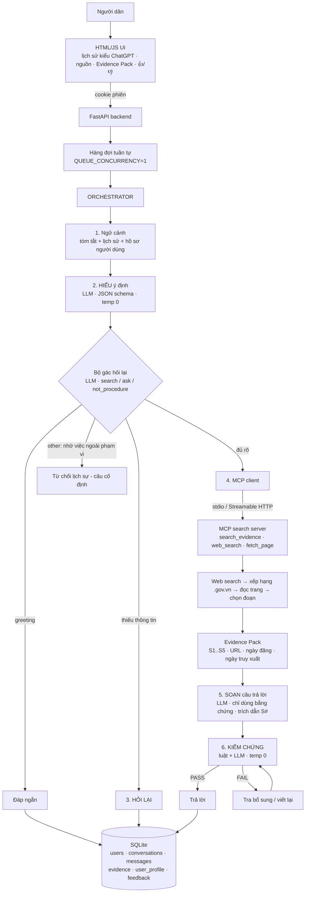

# Kiến trúc hệ thống

**Một câu:** mô hình 3–4B chạy local lo *hiểu và diễn đạt*; MCP/web search lo
*thông tin thủ tục hiện hành*; một lượt suy luận thứ hai *kiểm chứng* trước khi
trả lời; SQLite + hàng đợi tuần tự lo *bộ nhớ và thứ tự xử lý*.

## 0. Hai hệ thống trả lời (V10.3)

Từ V10.3 có **hai hệ thống chạy song song**, người dùng chuyển bằng **nút
"Web search"** ngay cạnh ô nhập:

| | Hệ thống 1 | Hệ thống 2 |
|---|---|---|
| Tên trong mã | `websearch` | `retrieval` |
| Module | `core/system_websearch.py` | `core/system_retrieval.py` |
| Nguồn tri thức | web .gov.vn, tra qua MCP | CSDL thủ tục nội bộ |
| Trạng thái | **đang chạy** (toàn bộ mục 1–6 dưới đây) | **CHƯA XÂY** — khung đã sẵn |

```
                      ┌─ system == "websearch" ─> system_websearch.run_turn()  HỆ THỐNG 1
chat_routes ─> orchestrator ─┤
   (TurnInput)           └─ system == "retrieval" ─> system_retrieval.run_turn()  HỆ THỐNG 2
                                                          (TurnResult)
```

- **Hợp đồng chung** `TurnInput` / `TurnResult` ở `core/turn.py`. Hệ thống nào
  cũng chỉ là một hàm `run_turn(inp, status) -> TurnResult`.
- **`core/orchestrator.py` không còn nghiệp vụ** — chỉ đọc `inp.system` rồi gọi
  đúng module (`SYSTEMS`). Thêm hệ thống thứ ba = thêm một dòng vào `SYSTEMS`.
- **Mỗi cuộc trò chuyện ghi nhớ hệ thống của nó** (`conversations.system`).
  Đổi hệ thống ⇒ **mở cuộc trò chuyện mới** (giống Gemini): hai nguồn tin khác
  nhau để chung một ô chat thì mô hình trộn dữ liệu và trả lời lẫn lộn. Luật
  này được ép ở **cả hai phía**: giao diện tự mở ô chat mới
  (`static/js/systems.js`), máy chủ trả **HTTP 409** nếu vẫn cố đổi giữa chừng.
- **Hệ thống 2 chưa xong thì nói thật.** `RETRIEVAL_ENABLED=false` (mặc định)
  ⇒ trả lời lịch sự là chưa sẵn sàng + mời bấm nút Web search, `kind=unavailable`.
  Không bao giờ trả lời chay.

Bốn chỗ cần cắm code cho Hệ thống 2 (xem docstring `core/system_retrieval.py`):
`extract_keys()` (LLM 1) → `lookup()` (CSDL) → `build_table()` (code, không LLM)
→ `follow_up()` (LLM 2 chăm sóc khách hàng). Xong cả bốn thì đặt
`RETRIEVAL_ENABLED=true`, muốn làm mặc định thì `DEFAULT_SYSTEM=retrieval`.

---

## 1. Sơ đồ tổng thể — Hệ thống 1 (web search)



```
USER ─> HTML/JS UI ─> FastAPI ─> Hàng đợi ─> ORCHESTRATOR
                                                 │
                              ┌──────────────────┴──────────────────┐
                              │  3–4B LLM (Ollama, 4-bit)            │
                              │  understand · answer · verify ·      │
                              │  summary · chitchat                  │
                              └──────────────────┬──────────────────┘
                                                 │ cần thông tin hiện hành
                                                 ▼
                              MCP search server (tthc-search)
                                 web search ─> .gov.vn trước ─> đọc trang
                                                 │
                                                 ▼
                                           Evidence Pack
                                                 │
                                   Answer ─> Verifier ─> PASS / RETRY
                                                 │
                                                 ▼
                              SQLite: người dùng + lịch sử + tóm tắt
                                      + Evidence Pack + phản hồi
```

## 2. Pipeline một lượt hỏi

| Bước | File | Vào | Ra |
|---|---|---|---|
| Nhận + xếp hàng | `api/chat_routes.py`, `core/queue.py` | tin nhắn | job tuần tự, luồng NDJSON |
| Ngữ cảnh | `core/summarizer.py` | hội thoại | tóm tắt + 10 tin gần nhất (tóm tắt khi > `MAX_CONTEXT_TOKENS`) |
| Hiểu ý định | `core/intent.py` | tin nhắn + ngữ cảnh + hồ sơ | intent, câu hỏi độc lập, tỉnh/xã, thiếu gì, câu hỏi lại, truy vấn |
| Bộ gác hỏi lại | `core/intent.py` | tin nhắn + 4 lượt gần nhất | `search` / `ask` / `greeting` / `other` |
| Hỏi lại | `core/intent.py` | cả hai bộ cùng thấy thiếu | câu hỏi lại do LLM viết (không hỏi dồn 2 lượt) |
| Tra cứu | `core/evidence.py` → `core/mcp_client.py` → `mcp_search/` | truy vấn | Evidence Pack |
| Soạn | `core/answer.py` | Evidence Pack + lịch sử | bản nháp có `[S#]` |
| Kiểm chứng | `core/verifier.py` | câu hỏi + bằng chứng + bản nháp | PASS / FAIL + lý do |
| Lưu | `db/repositories.py` | kết quả | messages, evidence, user_profile |

Toàn bộ điều phối của Hệ thống 1 ở `core/system_websearch.py` (~150 dòng, không đụng
CSDL). `core/orchestrator.py` chỉ còn việc chọn hệ thống — xem mục 0.

**Vì sao có bộ gác riêng:** đo trên `Evaluation/eval_set.jsonl` với qwen2.5:1.5b —
để bước hiểu ý định tự quyết định hỏi lại trong một JSON lớn thì mô hình hỏi lại
gần như mọi câu (clarification accuracy 43%). Tách thành một câu hỏi hẹp 3 lựa
chọn và chỉ chặn khi cả hai bộ cùng thấy thiếu thông tin: 100% trên cùng bộ câu
(bộ này cũng được dùng khi tinh chỉnh prompt — cần thêm câu mới để đo khách quan).

## 3. Evidence Pack

```json
{
  "question": "Đăng ký tạm trú cần những giấy tờ gì?",
  "queries": ["hồ sơ đăng ký tạm trú 2026", "hồ sơ đăng ký tạm trú 2026 site:gov.vn"],
  "retrieved_at": "2026-09-16T04:08:51+00:00",
  "transport": "mcp/stdio",
  "sources": [
    {"id": "S1", "title": "Hướng dẫn THỦ TỤC ĐĂNG KÝ TẠM TRÚ", "url": "https://...gov.vn/...",
     "domain": "uongbi.gov.vn", "trust": "official", "published_at": "2026-04-16",
     "retrieved_at": "...", "content": "đoạn liên quan nhất...", "fetched": true, "score": 6.3}
  ],
  "diagnostics": ["[ddgs] 'hồ sơ đăng ký tạm trú 2026' -> 8 kết quả (2761 ms)", "..."]
}
```

Xếp hạng nguồn = độ tin cậy tên miền (chính thống 3 > CSDL pháp luật 2 > báo
chí 1.5 > khác 1) + thứ hạng tìm kiếm + độ mới (năm trong tiêu đề/URL/ngày đăng)
+ độ liên quan của đoạn (BM25 chung trên mọi đoạn của mọi trang).

## 4. Cách tinh chỉnh từng thành phần

| Thành phần | Tham số | Mặc định | Khi nào đổi |
|---|---|---|---|
| LLM chính | `LLM_MODEL` | `qwen2.5:1.5b` (thử) | triển khai: `qwen2.5:3b` hoặc bản fine-tune 4-bit |
| | `TEMPERATURE` / `TOP_P` | 0.1 / 0.9 | thủ tục hành chính cần ổn định: giữ 0.1–0.2 |
| | `LLM_NUM_CTX` | 8192 | Evidence Pack + lịch sử phải lọt; giảm nếu thiếu VRAM |
| Hiểu ý định | temperature | 0 (cố định) | — |
| | prompt + ví dụ | `prompts/templates.py` | sai ý định kiểu mới → thêm ví dụ, KHÔNG thêm luật từ khoá |
| | `UNDERSTAND_FEWSHOT` | true | mô hình đã fine-tune: false |
| Bộ gác hỏi lại | `GATE_SYSTEM` + ví dụ | `prompts/templates.py` | hỏi lại quá nhiều → thêm ví dụ `search`; quá ít → thêm ví dụ `ask` |
| | `CLARIFY_ENABLED` | true | tắt = luôn tra cứu |
| Tìm kiếm | `SEARCH_PROVIDER` | `ddgs` | ổn định hơn: `searxng` tự host, `brave`/`tavily` có key |
| | `SEARCH_MAX_QUERIES` | 3 | nhiều hơn = phủ rộng hơn, chậm hơn |
| | `FETCH_TOP_N` / `EVIDENCE_TOP_K` | 6 / 5 | chất lượng nguồn quan trọng hơn số lượng |
| | `EVIDENCE_MAX_CHARS` | 7000 | mô hình nhỏ: đừng tăng quá ~9000 |
| | `OFFICIAL_DOMAINS`, `SEARCH_OFFICIAL_ONLY` | .gov.vn… / false | bật `true` nếu chỉ chấp nhận nguồn nhà nước |
| Kiểm chứng | `VERIFIER_ENABLED`, `MAX_VERIFY_RETRIES` | true, 1 | tắt để đo độ trễ; tăng retry nếu mô hình lớn hơn |
| | lỗi CỨNG (đánh trượt) | số tiền / thời hạn / số văn bản không có trong nguồn · trích dẫn [S#] không tồn tại · chép khung prompt · câu trả lời trống · LLM kiểm chứng chỉ ra lỗi cụ thể | sửa ở `core/verifier.py` |
| | lỗi MỀM (chỉ ghi nhận) | thiếu trích dẫn [S#] — mô hình 1.5B hay quên dù nội dung bám nguồn | |
| | `VERIFY_FAIL_POLICY` | `warn` | `refuse` = "Không đủ thông tin để xác nhận" |
| | `VERIFIER_MODEL` | = LLM_MODEL | dùng mô hình lớn hơn chỉ cho bước này nếu có VRAM |
| Bộ nhớ | `MAX_CONTEXT_TOKENS`, `SUMMARY_KEEP_RECENT` | 3000, 5 lượt | mô hình 3–4B: 6000 |
| Hàng đợi | `QUEUE_CONCURRENCY` | 1 | yêu cầu đề bài: xử lý từng tin nhắn một |

## 5. Dữ liệu

```
users ─┬─ auth_sessions
       ├─ user_profile (tỉnh/thành, xã/phường — nhớ xuyên hội thoại)
       └─ conversations ─┬─ messages ─┬─ evidence (Evidence Pack JSON)
       │   (.system: websearch | retrieval)
                         │            └─ feedback (phu_hop / khong_phu_hop; không chấm = trung bình)
                         └─ documents ── document_chunks (tệp đính kèm)
job_log (thời gian chờ / xử lý của hàng đợi)
```

`messages.kind`: answer · clarify · chitchat · out_of_scope · no_evidence · unavailable · error
`messages.verdict`: PASS · FAIL · rỗng

## 6. API

| Kiến trúc gốc | Endpoint thực tế |
|---|---|
| `POST /auth/login` | `POST /api/register`, `POST /api/login`, `POST /api/logout`, `GET /api/me` |
| `POST /chat` | `POST /api/conversations/{id}/chat` (NDJSON stream) |
| `GET /sessions` | `GET /api/conversations`, `POST /api/conversations` |
| `GET /sessions/{id}` | `GET /api/conversations/{id}` |
| `POST /feedback` | `POST /api/feedback` |
| — | `GET /api/messages/{id}/evidence`, `GET/DELETE /api/profile` |
| `GET /health` | `GET /health` (Ollama, mô hình, MCP, hệ thống nào đang bật) |
| — | `PATCH /api/conversations/{id}` đổi tên / đổi hệ thống (409 nếu đã có tin nhắn) |
| — | `/api/files/...` tệp đính kèm · `/api/dev/...` bảng nhà phát triển |

## 7. Vì sao không dùng …

- **Router từ khoá / semantic router:** đề bài cấm; người dân viết không dấu, hỏi
  nối tiếp — chỉ LLM đọc ngữ cảnh mới hiểu.
- **Dataset thủ tục nội bộ + vector DB:** đề bài cấm dùng dataset có sẵn; thông
  tin phải mới nhất → lấy từ web qua MCP. Vector DB chỉ thêm khi tra web không đủ.
- **PostgreSQL / Redis:** SQLite + hàng đợi asyncio đã đáp ứng "một người dùng
  một phiên, xử lý tuần tự" cho demo. Mọi SQL nằm ở `db/repositories.py`, hàng
  đợi ở `core/queue.py` — thay thế từng file khi cần mở rộng.
- **LangChain / multi-agent:** pipeline cố định 6 bước, không cần.
