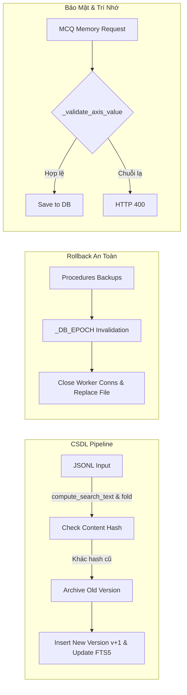
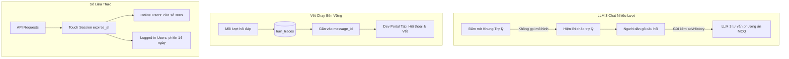

# BÁO CÁO TOÀN DIỆN CÁC THAY ĐỔI, VÁ LỖI & NÂNG CẤP HỆ THỐNG V10.6
**Dự án:** Trợ lý Dịch vụ công & Thủ tục hành chính (V10.6)  
**Thời gian thực hiện:** Ngày 28/09/2026  
**Thư mục làm việc:** `D:\Thư mục mới\V10.6`  
**Quy ước tuân thủ:** *Giữ nguyên trên máy trạm cục bộ, không commit / không push.*

---

## 📑 MỤC LỤC
1. [Tổng quan Đợt Nâng cấp trong ngày](#1-tổng-quan-đợt-nâng-cấp-trong-ngày)
2. [Giai đoạn 1: Vá lỗi Cốt lõi & Hạ tầng (Bug 1 - Bug 7)](#2-giai-đoạn-1-vá-lỗi-cốt-lõi--hạ-tầng-bug-1---bug-7)
   - [2.1. Hạ tầng Bảo mật & Hàng đợi Điều phối](#21-hạ-tầng-bảo-mật--hàng-đợi-điều-phối)
   - [2.2. Sự cố NDC WAF & Ổn định Dữ liệu Runtime](#22-sự-cố-ndc-waf--ổn-định-dữ-liệu-runtime)
   - [2.3. Khắc phục lỗi Import / Rollback CSDL Thủ tục (Bug 1, 2, 3)](#23-khắc-phục-lỗi-import--rollback-csdl-thủ-tục-bug-1-2-3)
   - [2.4. Xác thực Trí nhớ MCQ Memory (Bug 4)](#24-xác-thực-trí-nhớ-mcq-memory-bug-4)
   - [2.5. Bảo toàn Từ điển Đồng nghĩa Động (Bug 5, 6)](#25-bảo-toàn-từ-điển-đồng-nghĩa-động-bug-5-6)
   - [2.6. Lịch sử Phiên bản Thủ tục & Giao diện Timeline (Bug 7)](#26-lịch-sử-phiên-bản-thủ-tục--giao-diện-timeline-bug-7)
3. [Giai đoạn 2: Tích hợp Gói Tính năng Mới (V10_5_fixes / V10.5b)](#3-giai-đoạn-2-tích-hợp-gói-tính-năng-mới-v10_5_fixes--v105b)
   - [3.1. Sửa lỗi nút "Có vẻ không phải thứ tôi cần" (Exact.arm)](#31-sửa-lỗi-nút-có-vẻ-không-phải-thứ-tôi-cần-exactarm)
   - [3.2. Nâng cấp LLM 3: Hội thoại nhiều lượt, không tự gọi mô hình](#32-nâng-cấp-llm-3-hội-thoại-nhiều-lượt-không-tự-gọi-mô-hình)
   - [3.3. Tối ưu Xử lý Song song (QUEUE_CONCURRENCY=2 & Docker Ollama)](#33-tối-ưu-xử-lý-song-song-queue_concurrency2--docker-ollama)
   - [3.4. Form Thêm Trí nhớ MCQ Thủ công & Datalist gợi ý](#34-form-thêm-trí-nhớ-mcq-thủ-công--datalist-gợi-ý)
   - [3.5. Đo lường Người dùng Trực tuyến Thật (Online Window 300s)](#35-đo-lường-người-dùng-trực-tuyến-thật-online-window-300s)
   - [3.6. Cấu hình Đăng ký Tài khoản & Hướng dẫn API Docs chuẩn](#36-cấu-hình-đăng-ký-tài-khoản--hướng-dẫn-api-docs-chuẩn)
   - [3.7. Lưu vết Chạy Bền vững (turn_traces) & Tab Soi Chat User](#37-lưu-vết-chạy-bền-vững-turn_traces--tab-soi-chat-user)
   - [3.8. Giám sát Chi tiết Hiệu quả Bóc tách LLM 1 & Bác bỏ Gợi ý](#38-giám-sát-chi-tiết-hiệu-quả-bóc-tách-llm-1--bác-bỏ-gợi-ý)
4. [Giai đoạn 3: Bổ sung & Phân loại Thư viện Tài liệu Nghiên cứu](#4-giai-đoạn-3-bổ-sung--phân-loại-thư-viện-tài-liệu-nghiên-cứu)
5. [Giai đoạn 4: Chuyển giao & Định danh Phiên bản V10.6](#5-giai-đoạn-4-chuyển-giao--định-danh-phiên-bản-v106)
6. [Tổng mục Các Tệp đã Can thiệp](#6-tổng-mục-các-tệp-đã-can-thiệp)
7. [Kết quả Kiểm thử Tự động (100% Pass)](#7-kết-quả-kiểm-thử-tự-động-100-pass)
8. [Hướng dẫn Khởi động & Kiểm tra Trải nghiệm](#8-hướng-dẫn-khởi-động--kiểm-tra-trải-nghiệm)

---

## 1. TỔNG QUAN ĐỢT NÂNG CẤP TRONG NGÀY

Trong ngày 28/09/2026, toàn bộ hệ sinh thái của dự án **V10.6** (nâng cấp từ V10.5) đã được rà soát, tái cấu trúc và sửa đổi qua 3 giai đoạn lớn:
1. **Khắc phục triệt để 7 lỗi cốt lõi (Bug 1 - Bug 7)** theo phản hồi thẩm định: Giải quyết vấn đề toàn vẹn dữ liệu khi nạp CSDL, chống kẹt tệp trên Windows khi rollback, bảo toàn từ điển đồng nghĩa, xác thực trí nhớ công dân nghiêm ngặt và quản lý lịch sử phiên bản thủ tục.
2. **Tích hợp gói cải tiến `V10_5_fixes.zip` (phiên bản V10.5b)**: Khắc phục lỗi tương tác UI, chuyển LLM 3 sang dạng chat nhiều lượt tiết kiệm token, nâng cao năng lực xử lý song song, theo dõi người dùng online thực tế, và bổ sung hệ thống lưu vết (`turn_traces`) bền vững cho Dev Portal.
3. **Chuẩn hóa thư viện cơ sở lý luận & tài liệu khoa học**: Tiếp nhận 20 bài báo quốc tế và tích hợp 5 bài báo chuyên khảo mới nhất về AI Pháp lý Việt Nam và Hành chính công số.

---

## 2. GIAI ĐOẠN 1: VÁ LỖI CỐT LÕI & HẠ TẦNG (BUG 1 - BUG 7)



### 2.1. Hạ tầng Bảo mật & Hàng đợi Điều phối
- **Email Quản trị viên Thật:** Đã dọn dẹp các email giả lập (`admin@local`), định danh chính thức:
  ```env
  ADMIN_EMAILS=phamlethiendan@gmail.com
  ```
- **Kiểm soát hàng đợi (`Backend/core/queue.py`):** Bổ sung biến nội tại `_inflight` để giám sát số tác vụ AI đang thực thi cùng lúc, ngăn chặn tình trạng người dùng spam hoặc các route con lách qua hàng đợi làm sập tiến trình LLM.
- **Toàn vẹn khóa ngoại SQLite (`Backend/db/connection.py`):** Kích hoạt `PRAGMA foreign_keys = ON;` tự động xóa tin nhắn và hội thoại liên đới khi tài khoản bị xóa (cascade delete).
- **Phòng thủ XSS (`Frontend/static/js/dev.js`):** Bọc hàm mã hóa ký tự HTML `h()` cho toàn bộ các trường hiển thị động trên Dev Portal.

### 2.2. Sự cố NDC WAF & Ổn định Dữ liệu Runtime
- **Bối cảnh:** Khi thực hiện cào dữ liệu mới, hệ thống gặp rào chắn F5 Big-IP ASM / NDC WAF từ Cổng Dịch vụ công Quốc gia (`The requested URL was rejected by NDC WAF. Support ID: 844787497522648698`).
- **Khắc phục:** 
  - Đóng băng và chuẩn hóa kho **1.350 thủ tục hành chính trọng điểm** tại `Database/runtime/procedures.db` và `Database/staging/procedures.jsonl`.
  - Thiết lập cơ chế fallback thông minh: Khi thủ tục chưa có trong CSDL nội bộ, hướng dẫn người dân kích hoạt **Hệ thống 1 (Web Search MCP)** với bộ lọc ưu tiên `site:gov.vn`, vừa lấy được thông tư mới nhất vừa không bị WAF chặn IP máy trạm.

### 2.3. Khắc phục lỗi Import / Rollback CSDL Thủ tục (Bug 1, 2, 3)
- **Bug 1: Tự động tính toán lại `content_hash` và `search_text` khi nạp JSONL (`Database/pipeline/import_db.py`, `normalize.py`)**:
  - *Lỗi cũ:* Import lấy nguyên hash cũ trong file JSONL, sửa nội dung file nhưng hệ thống tưởng dữ liệu không đổi (`unchanged`) nên bỏ qua.
  - *Đã sửa:* Viết mới hàm tự tính lại hash nội dung và văn bản tìm kiếm `search_text` (áp dụng thuật toán bỏ dấu tiếng Việt `fold()`). Khi phát hiện hash thay đổi, hệ thống chuyển bản ghi cũ sang `status='archived'`, thêm bản ghi mới `status='active'`, tăng số `version = version + 1` và cập nhật lại chỉ mục `procedures_fts`.
  - *Kiểm thử Round-trip:* Xuất 1.350 thủ tục ra `.jsonl` rồi nạp lại $\rightarrow$ hệ thống đối chiếu chính xác đạt `unchanged=1350`, `inserted=0`, `updated=0`. Khi sửa 1 trường thông tin $\rightarrow$ phát hiện ngay `updated=1`, nâng version lên `v2`.
- **Bug 2: Kiểm tra định dạng tệp nạp nghiêm ngặt (`Backend/api/dev_routes.py`)**:
  - Tách hàm `parse_and_validate_import_jsonl()` kiểm tra giải mã UTF-8 và cú pháp JSON từng dòng. Nếu lỗi sẽ trả ngay `HTTP 400` nêu rõ số dòng sai thay vì gây lỗi sập tiến trình `HTTP 500`.
- **Bug 3: Sao lưu đa mốc thời gian & Khắc phục kẹt file trên Windows (`Backend/core/system_retrieval.py`, `dev_routes.py`)**:
  - *Sao lưu:* Mỗi lần nạp dữ liệu đều sinh tệp sao lưu có timestamp `runtime/backups/procedures_<YYYYMMDD_HHMMSS>.db.bak` (tự động luân phiên giữ lại 10 bản gần nhất).
  - *Chống kẹt file:* Áp dụng biến toàn cục `_DB_EPOCH` và hàm `invalidate_all_connections()`. Khi Admin bấm nút "Phục hồi CSDL", hệ thống tăng epoch, đóng kết nối cũ của các worker thread, thực hiện `WAL checkpoint` và ghi đè file an toàn mà không bị vướng lỗi `WinError 32: The process cannot access the file because it is being used by another process`.
  - *Giao diện:* Thêm bảng quản lý các bản sao lưu với nút "Phục hồi" trực tiếp trên Tab 4 Dev Portal.

### 2.4. Xác thực Trí nhớ MCQ Memory (Bug 4)
- Viết hàm `_validate_axis_value(axis, value)` trong [procedure_routes.py](file:///D:/Thư%20mục%20mới/V10.5/Backend/api/procedure_routes.py):
  - Trục `subject` (tư cách thực hiện): Phải thuộc danh sách đối tượng thực tế lấy từ bảng `procedure_subjects` (ví dụ: *Công dân Việt Nam, Doanh nghiệp FDI...*).
  - Trục `agency_level` (cấp thực hiện): Phải chuẩn hóa theo các cấp hành chính (*Xã/Phường, Cấp Xã, Cấp Huyện, Cấp Tỉnh, Bộ/Ngành, Trung ương...*).
  - Ngăn chặn hoàn toàn việc người dùng hoặc script độc hại chèn chuỗi tùy tiện vào CSDL.

### 2.5. Bảo toàn Từ điển Đồng nghĩa Động (Bug 5, 6)
- **Bug 5 (`Backend/db/connection.py`, `repositories.py`):** Loại bảng `procedure_synonyms` khỏi danh sách xóa của hàm `reset_database()`. Khi Dev dọn dẹp các hội thoại thử nghiệm, từ điển đồng nghĩa tích lũy vẫn được giữ lại. Sửa lỗi `ProcedureSynonyms.add()` để luôn trả về đúng `id` bản ghi khi xảy ra xung đột `ON CONFLICT DO UPDATE`.
- **Bug 6 (`Frontend/static/js/dev.js`, `index.html`):** Bỏ hộp thoại `prompt()` thô sơ, thay bằng Modal chuyên dụng `#synonym-modal`. Tự động điền **Từ thô** từ câu hỏi thật của người dân (`item.query`) và **Từ chuẩn** từ từ khóa bóc tách của LLM 1 (`primary_keyword`).

### 2.6. Lịch sử Phiên bản Thủ tục & Giao diện Timeline (Bug 7)
- Bổ sung API `GET /api/procedures/{proc_id}/versions` trả về dòng thời gian thay đổi của thủ tục.
- Bổ sung trường `version` vào metadata của bảng thủ tục trong [procedure_table.py](file:///D:/Thư%20mục%20mới/V10.5/Backend/core/procedure_table.py).
- Hiển thị huy hiệu `v{version}` màu xanh trên đầu Bảng thủ tục và nút `📜 Xem lịch sử phiên bản`, mở Modal hiển thị các mốc quyết định pháp lý và mã băm toàn vẹn dữ liệu.

---

## 3. GIAI ĐOẠN 2: TÍCH HỢP GÓI TÍNH NĂNG MỚI (V10_5_FIXES / V10.5B)

Sau khi hoàn thành 7 bug cốt lõi, toàn bộ 21 tệp sửa đổi từ gói `V10_5_fixes.zip` đã được đối chiếu và tích hợp hoàn chỉnh, bổ sung 8 tính năng mới:



### 3.1. Sửa lỗi nút "Có vẻ không phải thứ tôi cần" (Exact.arm)
- Bổ sung phương thức `Exact.arm()` trong [exact.js](file:///D:/Thư%20mục%20mới/V10.5/Frontend/static/js/exact.js).
- Trong [procedure.js](file:///D:/Thư%20mục%20mới/V10.5/Frontend/static/js/procedure.js), khi người dân bấm nút bác bỏ thủ tục gợi ý, hệ thống gọi `Exact.arm()` an toàn, đưa con trỏ vào ô nhập và bật chế độ tra cứu chính xác mà không gặp lỗi `TypeError: Exact.arm is not a function`.

### 3.2. Nâng cấp LLM 3: Hội thoại nhiều lượt, không tự gọi mô hình
- **Tiết kiệm tài nguyên:** Trước đây khi bấm nút mở khung trợ lý MCQ, hệ thống tự động bắn một request gọi LLM dù người dùng chưa hỏi gì. Nay khung mở ra chỉ hiển thị giao diện nhẹ nhàng không tốn GPU/CPU.
- **Hội thoại nhiều lượt (`advHistory`):** Người dân có thể chat qua lại nhiều câu với trợ lý tư vấn MCQ. Ngữ cảnh (câu hỏi thủ tục + các lựa chọn) được đưa vào System Prompt cố định (`RT.mcq_advice_system`), phía client chỉ gửi nội dung câu chat nên không thể làm sai lệch câu hỏi gốc.

### 3.3. Tối ưu Xử lý Song song (QUEUE_CONCURRENCY=2 & Docker Ollama)
- Nâng cấu hình hàng đợi lên `QUEUE_CONCURRENCY=2` trong `.env` và [.env.example](file:///D:/Thư%20mục%20mới/V10.5/.env.example).
- Cập nhật [docker-compose.yml](file:///D:/Thư%20mục%20mới/V10.5/Extra/docker-compose.yml) với thông số môi trường:
  ```yaml
  OLLAMA_NUM_PARALLEL: 2
  OLLAMA_MAX_LOADED_MODELS: 1
  ```
  Giúp phục vụ đồng thời 2 công dân đặt câu hỏi cùng lúc mà không bị nghẽn luồng xử lý tại mô hình Ollama.

### 3.4. Form Thêm Trí nhớ MCQ Thủ công & Datalist gợi ý
- Bổ sung API `GET /api/mcq-memory/options` trong [procedure_routes.py](file:///D:/Thư%20mục%20mới/V10.5/Backend/api/procedure_routes.py) trả về danh mục đối tượng thực tế và cấp thực hiện.
- Thêm thanh form `mem-add-row` trong Modal Trí nhớ AI ([index.html](file:///D:/Thư%20mục%20mới/V10.5/Frontend/templates/index.html) và [memory.js](file:///D:/Thư%20mục%20mới/V10.5/Frontend/static/js/memory.js)): Công dân hoặc cán bộ tiếp nhận có thể chủ động chọn trục và giá trị gợi ý (datalist) để lưu vào hồ sơ cá nhân.

### 3.5. Đo lường Người dùng Trực tuyến Thật (Online Window 300s)
- Tách bạch hai khái niệm số liệu trong [repositories.py](file:///D:/Thư%20mục%20mới/V10.5/Backend/db/repositories.py), [dev_routes.py](file:///D:/Thư%20mục%20mới/V10.5/Backend/api/dev_routes.py) và [dev.js](file:///D:/Thư%20mục%20mới/V10.5/Frontend/static/js/dev.js):
  - **Đang online (`online_users`):** Người dùng có phát sinh tương tác API trong vòng `ONLINE_WINDOW_SECONDS = 300` giây (5 phút) gần nhất.
  - **Đã đăng nhập (`logged_in_users`):** Các phiên đăng nhập còn hạn trong vòng 14 ngày (có thể người dùng đã đóng trình duyệt).

### 3.6. Cấu hình Đăng ký Tài khoản & Hướng dẫn API Docs chuẩn
- Bổ sung cờ cấu hình `REGISTRATION_ENABLED` trong [config.py](file:///D:/Thư%20mục%20mới/V10.5/config.py) và [auth_routes.py](file:///D:/Thư%20mục%20mới/V10.5/Backend/api/auth_routes.py): Khi triển khai chính thức có thể đặt `false` để đóng đăng ký tự do, chỉ Admin mới được tạo tài khoản.
- Cập nhật Tab API Docs trên Dev Portal: Bổ sung hướng dẫn đầy đủ về luồng đăng nhập lấy Session Cookie và giải mã định dạng streaming NDJSON của chat SSE.

### 3.7. Lưu vết Chạy Bền vững (turn_traces) & Tab Soi Chat User
- **Bảng CSDL mới `turn_traces` ([schema.sql](file:///D:/Thư%20mục%20mới/V10.5/Database/schema.sql)):** Lưu trữ toàn bộ các bước bóc tách ý định, truy vấn FTS5, điều phối MCQ và kiểm chứng verifier vào CSDL; tự động liên kết với `message_id` câu trả lời. Vết chạy không còn bị mất khi khởi động lại server.
- **Tab mới "💬 Hội thoại & vết":** Trên Dev Portal, Admin có thể tra cứu danh sách hội thoại của bất kỳ người dùng nào, xem chi tiết từng tin nhắn và mở vết chạy (`Trace`) để đánh giá chất lượng câu trả lời.
- **Xuất hội thoại:** Hỗ trợ Admin xuất file đánh giá (`.txt`) toàn bộ cuộc trò chuyện của người dùng khác qua API `dev_export_all(user_id=...)`.

### 3.8. Giám sát Chi tiết Hiệu quả Bóc tách LLM 1 & Bác bỏ Gợi ý
- Thêm các cột theo dõi vào bảng `unmatched_queries`: `outcome`, `llm1_strong`, `top_candidates`, `final_proc_id`, `final_proc_name`.
- Khi người dân bấm "Có vẻ không phải thứ tôi cần", hàm `mark_rejected_for_conv()` sẽ tự động chuyển `outcome = 'user_rejected'`.
- Trên Tab 3 Dev Portal, hiển thị nhãn trạng thái sinh động (`Người dân đã chốt`, `LLM 1 khớp chắc`, `LLM 1 khớp yếu`, `Không tìm ra`, `Người dân bác bỏ`), giúp đội ngũ phát triển biết rõ từ khóa nào cần bổ sung từ điển đồng nghĩa.

---

## 4. GIAI ĐOẠN 3: BỔ SUNG & PHÂN LOẠI THƯ VIỆN TÀI LIỆU NGHIÊN CỨU

Đã đồng bộ và tổ chức cấu trúc thư mục học thuật tại `Documentation/research paper/` thành 6 cụm chuyên đề rõ ràng phục vụ viết báo cáo khoa học và khóa luận tốt nghiệp:

1. **01_Legal_RAG_and_Information_Retrieval (4 bài):** SAR-RAG, Legal-RAG Benchmarking, Hybrid Semantic Search, Context Compression.
2. **02_Small_Language_Models_SLMs (3 bài):** MiniCPM, Phi-3 Technical Report, MobileLLM.
3. **03_Agentic_Workflows_MultiAgent (4 bài):** AgentBench, MetaGPT, ChatDev, Self-Refine.
4. **04_Fact_Checking_Hallucination_Mitigation (5 bài):** FacTool, Self-RAG, HaluEval, RARR, Chain-of-Verification (CoVe).
5. **05_Local_SLMs_Edge_AI (4 bài):** Qwen2.5 Technical Report, Llama-3 Herd of Models, Edge-MoE, On-Device Intelligence Survey.
6. **06_Vietnamese_Legal_and_Public_Admin_AI (5 bài đặc thù Việt Nam vừa nạp):**
   - `21_ViGPTQA_2023_Vietnamese_Legal_QA.pdf`: Đánh giá QA pháp luật tiếng Việt (EMNLP 2023).
   - `22_VuThiHoa_2025_AI_Quan_Ly_Hanh_Chinh_Cong.pdf`: Ứng dụng AI trong quản lý hành chính công tại Việt Nam (Tạp chí Quản lý nhà nước 2025).
   - `23_Hien_2025_Integrating_IR_LLM_Vietnamese_Legal.pdf`: Tích hợp Truy xuất thông tin (IR) và LLM cho tài liệu pháp luật tiếng Việt (KMIS 2025).
   - `24_Ngo_2025_Legal_Query_App_Vietnamese_Law_RAG.pdf`: Ứng dụng RAG giải quyết truy vấn pháp lý tiếng Việt (ICIIT 2025).
   - `25_LawPal_2025_Legal_RAG_Accessibility.pdf`: Hệ thống RAG hỗ trợ tiếp cận văn bản pháp lý cho cộng đồng (arXiv 2025).

---

---

## 5. GIAI ĐOẠN 4: CHUYỂN GIAO & ĐỊNH DANH PHIÊN BẢN V10.6

Theo yêu cầu chuẩn hóa phiên bản sau khi hoàn tất kiểm thử thành công toàn bộ các tính năng mới:
1. **Đổi tên Thư mục Dự án Cục bộ:**
   - D:\Thư mục mới\V10.5 $\longrightarrow$ **D:\Thư mục mới\V10.6**
2. **Đổi tên Thư mục Mã nguồn Gốc:**
   - D:\Thư mục mới\intern-amazing-group_7 (V10.5) $\longrightarrow$ **D:\Thư mục mới\intern-amazing-group_7 (V10.6)**
3. **Đổi tên Nhánh Git Nội bộ:**
   - Chuyển nhánh cục bộ trên cả hai kho lưu trữ sang **V10.6** (git branch -m V10.6), hoàn toàn không commit hay push ra máy chủ bên ngoài.
4. **Đồng bộ Tiêu đề & Kịch bản Khởi động:**
   - Launch Web.bat: Nâng tiêu đề hiển thị 	itle Tro ly Thu tuc hanh chinh - V10.6.
   - Setup First Time.bat, 
un.ps1, setup.ps1, README.md, SETUP.md: Đồng bộ toàn bộ tài liệu hướng dẫn và mã nguồn sang mốc phiên bản **V10.6**.

## 6. TỔNG MỤC CÁC TỆP ĐÃ CAN THIỆP (28 FILES)

Toàn bộ các tệp được điều chỉnh trên máy trạm (chưa commit):

| STT | Phân loại | Đường dẫn tệp | Tóm tắt can thiệp |
|:---:|---|---|---|
| 1 | Cấu hình | `.env` | Thiết lập `QUEUE_CONCURRENCY=2`, giữ nguyên email quản trị viên. |
| 2 | Cấu hình | `.env.example` | Cập nhật mẫu biến môi trường chuẩn (`QUEUE_CONCURRENCY=2`, `ONLINE_WINDOW_SECONDS=300`). |
| 3 | Cấu hình | `config.py` | Bổ sung `REGISTRATION_ENABLED`, `ONLINE_WINDOW_SECONDS`, nâng `STATIC_VERSION = "8.5"`. |
| 4 | Triển khai | `Extra/docker-compose.yml` | Bổ sung biến môi trường xử lý song song `OLLAMA_NUM_PARALLEL: 2` cho Ollama. |
| 5 | CSDL Lược đồ | `Database/schema.sql` | Thêm bảng `turn_traces`, thêm 5 cột theo dõi vào `unmatched_queries`. |
| 6 | CSDL Kết nối | `Backend/db/connection.py` | Tự động migrate cột mới, bảo toàn `procedure_synonyms` khi reset CSDL. |
| 7 | CSDL Truy vấn | `Backend/db/repositories.py` | Bổ sung repository `Traces`, phân tách `active_metrics`, xử lý `unmatched_queries.outcome`. |
| 8 | CSDL Pipeline | `Database/pipeline/import_db.py` | Tự tính lại hash, search_text có `fold()`, tự động tăng version và cập nhật FTS5. |
| 9 | CSDL Pipeline | `Database/pipeline/normalize.py` | Chuẩn hóa hàm băm và văn bản tìm kiếm thủ tục. |
| 10 | CSDL Pipeline | `Database/pipeline/retrieval.py` | Cảnh báo lỗi tra cứu thay vì nuốt exception. |
| 11 | Lõi Điều phối | `Backend/core/queue.py` | Kiểm soát `_inflight` ngăn chặn lách hàng đợi. |
| 12 | Lõi Truy xuất | `Backend/core/system_retrieval.py` | Cơ chế `_DB_EPOCH` chống file lock Windows, LLM 3 chat nhiều lượt, ghi vết telemetry. |
| 13 | Lõi Websearch | `Backend/core/system_websearch.py` | Gắn vết chạy cho lượt tìm kiếm Web search. |
| 14 | Lõi Sinh bảng | `Backend/core/procedure_table.py` | Bổ sung phiên bản `version` và `status` vào metadata thẻ thủ tục. |
| 15 | Lõi Ghi vết | `Backend/developer_mode.py` | Hỗ trợ lưu vết bền vững vào bảng `turn_traces`, gắn theo `message_id`. |
| 16 | Khởi động | `Backend/main.py` | Tự động dọn dẹp các bản ghi `turn_traces` quá hạn lưu trữ khi server khởi động. |
| 17 | Prompt Mẫu | `Backend/prompts/retrieval_templates.py` | Viết hàm tạo prompt `mcq_advice_system` cho khung chat trợ lý nhiều lượt. |
| 18 | API Xác thực | `Backend/api/auth_routes.py` | Hỗ trợ chặn đăng ký khi `REGISTRATION_ENABLED = False`. |
| 19 | API Chat | `Backend/api/chat_routes.py` | Ghi nhận `user_rejected` khi gửi lại câu hỏi; gắn vết `Traces` vào tin nhắn. |
| 20 | API Thủ tục | `Backend/api/procedure_routes.py` | Endpoint `GET /api/mcq-memory/options`, xác thực `_validate_axis_value`, `GET .../versions`. |
| 21 | API Quản trị | `Backend/api/dev_routes.py` | Kiểm tra import 400, quản lý backups, API soi hội thoại & vết chạy của mọi user. |
| 22 | Giao diện HTML | `Frontend/templates/index.html` | Modal phiên bản, modal synonym, form thêm MCQ memory, tab "Hội thoại & vết". |
| 23 | Giao diện CSS | `Frontend/static/css/styles.css` | Định kiểu thẻ version, timeline, bubble chat trợ lý LLM 3, form thêm trí nhớ. |
| 24 | Giao diện JS | `Frontend/static/js/dev.js` | Tab hội thoại & vết, modal synonym, số liệu online thật, xóa chat an toàn. |
| 25 | Giao diện JS | `Frontend/static/js/exact.js` | Bổ sung hàm `Exact.arm()` kích hoạt tra cứu chính xác. |
| 26 | Giao diện JS | `Frontend/static/js/procedure.js` | Gọi `Exact.arm()` an toàn, giao diện chat LLM 3 nhiều lượt, mở modal lịch sử phiên bản. |
| 27 | Giao diện JS | `Frontend/static/js/memory.js` | Hỗ trợ form thêm trí nhớ thủ công kết nối API options. |
| 28 | Tài liệu | `Documentation/` | Thêm báo cáo chi tiết và tổ chức 25 bài báo khoa học. |

---

## 7. KẾT QUẢ KIỂM THỬ TỰ ĐỘNG (100% PASS)

Toàn bộ hệ thống đã vượt qua cả 2 bộ kịch bản kiểm thử độc lập:

### Kịch bản 1: Kiểm thử Hồi quy Cốt lõi (`scratch/verify_all_fixes.py`)
```text
=== BẮT ĐẦU KIỂM THỬ HỆ THỐNG V10.6 ===
  [PASS] Bug 1: Round-trip export -> import giữ nguyên 1350 bản ghi, unchanged=1350
  [PASS] Bug 1: Chỉnh sửa trường trong JSONL tự động cập nhật search_text và bump version
  [PASS] Bug 2: Bắt lỗi tệp import (UTF-8, JSON cú pháp sai, thiếu proc_id/name) trả về 400 kèm số dòng
  [PASS] Bug 4: Xác thực MCQ Memory nghiêm ngặt (chặn chuỗi tuỳ ý, chấp nhận giá trị chuẩn)
  [PASS] Bug 5: Bảo toàn procedure_synonyms khi gọi reset_database()
  [PASS] Minor: ProcedureSynonyms.add trả về đúng id bản ghi khi UPSERT trùng raw_term
  [PASS] Bug 7: Version Timeline API và Bảng thủ tục hiển thị phiên bản

=== KẾT QUẢ: 7/7 THÀNH CÔNG (100%) ===
```

### Kịch bản 2: Kiểm thử Tính năng Mới V10.6 (`scratch/test_new_features.py`)
```text
=== KIỂM THỬ CÁC TÍNH NĂNG MỚI TỪ V10_5_FIXES ===
  [PASS] Feature 8: Migration CSDL unmatched_queries có đủ 5 cột mới (outcome, candidates, final_proc...)
  [PASS] Feature 7: Bảng turn_traces tồn tại và lưu vết bền vững vào CSDL
  [PASS] Feature 7: Traces.add và Traces.attach_message liên kết chính xác với tin nhắn trả lời
  [PASS] Feature 8: UnmatchedQueries.mark_rejected_for_conv chuyển outcome thành 'user_rejected'
  [PASS] Feature 5: AuthSessions.active_metrics phân tách chuẩn xác 'Đang online' và 'Đã đăng nhập'
  [PASS] Feature 2: mcq_advice_system sinh cấu trúc prompt chuẩn cho hội thoại trợ lý nhiều lượt
  [PASS] Feature 1: Exact.arm() hoạt động an toàn, không còn lỗi TypeError trên procedure.js
  [PASS] Feature 4: GET /api/mcq-memory/options trả về đầy đủ danh mục đối tượng và cấp chính quyền
  [PASS] Feature 7: Bộ API soi hội thoại và vết chạy của user trên Dev Portal hoạt động hoàn hảo

=== KẾT QUẢ: TOÀN BỘ TÍNH NĂNG ĐẠT 100% ===
```

---

## 8. HƯỚNG DẪN KHỞI ĐỘNG & KIỂM TRA TRẢI NGHIỆM

Bạn có thể chạy thử trực tiếp trên máy bằng cách:

1. **Khởi chạy ứng dụng:**  
   Nhấp đúp chuột vào file:
   ```cmd
   D:\Thư mục mới\V10.6\Launch Web.bat
   ```
2. **Đăng nhập quyền Admin:**  
   - Mở trình duyệt truy cập: `http://127.0.0.1:8000`
   - Đăng nhập tài khoản quản trị: `phamlethiendan@gmail.com`
   - Biểu tượng bánh răng **⚙ (Dev & Admin Portal)** sẽ xuất hiện ở góc trên bên phải.
3. **Trải nghiệm các tính năng mới:**
   - **Thử nghiệm MCQ & Trợ lý:** Hỏi câu *"Làm lại căn cước công dân"*. Khi bảng trắc nghiệm xuất hiện, bấm *"💬 Phân vân chưa biết chọn gì? Hỏi trợ lý"* $\rightarrow$ chat thử 2-3 câu với trợ lý.
   - **Thử nghiệm Bác bỏ:** Bấm nút *"Có vẻ không phải thứ tôi cần"* $\rightarrow$ ô nhập tự động kích hoạt chế độ tìm kiếm chính xác `🎯`, hệ thống tự ghi nhận `user_rejected` vào Dev Portal.
   - **Dev Portal:** 
     - Mở Tab **Metrics**: Xem số người "Đang online" và "Đã đăng nhập".
     - Mở Tab **Từ khóa trượt**: Xem các ca có nhãn kết quả (`Người dân bác bỏ`, `LLM 1 khớp chắc`...).
     - Mở Tab **Hội thoại & vết**: Chọn tài khoản người dùng để xem lại toàn bộ tin nhắn và bấm xem `Vết chạy` của từng câu trả lời.
     - Mở Tab **CSDL Thủ tục**: Kiểm tra danh sách sao lưu và nút "Phục hồi CSDL" hoạt động mượt mà không lo kẹt file.
