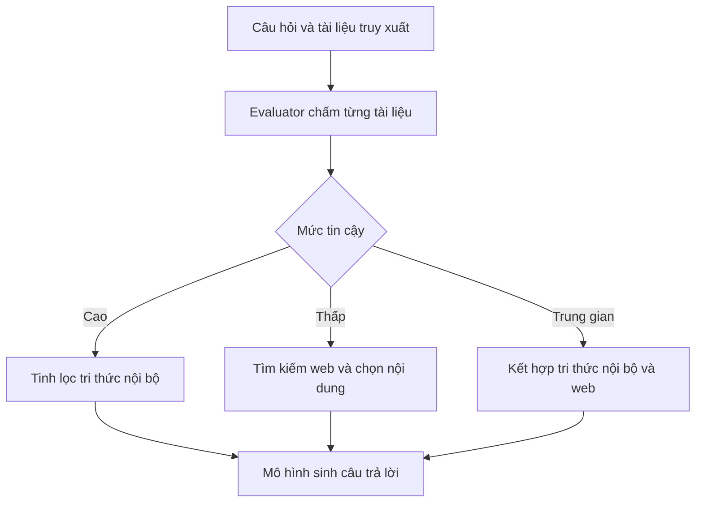

# (1) Tóm tắt tổng quan

Bài báo *Corrective Retrieval Augmented Generation* (CRAG) giải quyết một điểm yếu quan trọng của RAG: hệ thống thường đưa tài liệu truy xuất vào ngữ cảnh của mô hình sinh mà không kiểm tra đầy đủ xem chúng có liên quan hay đáng tin cậy hay không. Khi truy xuất sai, tài liệu không chỉ không giúp ích mà còn có thể khiến mô hình tạo ra thông tin sai lệch. CRAG đề xuất một cơ chế tự hiệu chỉnh gồm bộ đánh giá truy xuất nhẹ, quy trình tinh lọc nội dung tài liệu và tìm kiếm web bổ sung khi nguồn ban đầu bị đánh giá là không phù hợp. Đóng góp chính của bài báo là biến chất lượng truy xuất thành căn cứ để lựa chọn cách sử dụng tri thức, thay vì mặc định sử dụng mọi kết quả. Tác giả cho thấy cơ chế này có thể tích hợp với các hệ thống RAG hiện có và cải thiện kết quả trên nhiều loại nhiệm vụ, dù mức cải thiện phụ thuộc vào mô hình nền và bộ dữ liệu (Yan et al., 2024).

# (2) Bối cảnh và động lực

Mô hình ngôn ngữ lớn có thể tạo văn bản trôi chảy nhưng vẫn mắc lỗi thực tế hoặc đưa ra thông tin lỗi thời. Tri thức tham số được hình thành trong quá trình huấn luyện không bảo đảm rằng mô hình sẽ trả lời chính xác cho mọi câu hỏi, nhất là khi câu hỏi liên quan đến thực thể ít phổ biến hoặc kiến thức cần cập nhật. RAG được phát triển như một giải pháp bổ sung: hệ thống truy xuất tài liệu từ một kho tri thức rồi đưa chúng vào đầu vào của mô hình sinh. Tuy vậy, hiệu quả của RAG phụ thuộc chặt chẽ vào chất lượng tài liệu được lấy về. Nếu tài liệu không liên quan, mô hình có thể bị đánh lạc hướng và tái tạo hoặc khuếch đại thông tin sai. Vì thế, kết quả truy xuất kém không đơn thuần làm giảm độ chính xác mà còn có nguy cơ làm câu trả lời sai có vẻ đáng tin hơn nhờ được trình bày dựa trên ngữ cảnh bên ngoài (Yan et al., 2024).

Bài báo nêu thêm một hạn chế trong cách dùng tài liệu: nhiều hệ thống xử lý cả tài liệu như một khối thống nhất, dù chỉ một phần nhỏ có thể liên quan đến câu hỏi. Thông tin thừa vừa làm tăng nhiễu vừa khiến mô hình phải dựa vào những đoạn không cần thiết. CRAG tập trung vào hai vấn đề gắn liền với nhau: nhận biết khi nào kết quả truy xuất không đáng tin và sử dụng có chọn lọc phần tri thức hữu ích. Cách tiếp cận này khác với những phương pháp chủ yếu quyết định có cần truy xuất hay không; trọng tâm của CRAG là xử lý trường hợp hệ thống đã truy xuất nhưng kết quả có thể sai hoặc không đầy đủ (Yan et al., 2024).

# (3) Phương pháp CRAG

CRAG nhận câu hỏi cùng các tài liệu do một bộ truy xuất bên ngoài cung cấp. Sau đó, hệ thống đánh giá chất lượng kết quả, chọn hành động tương ứng và đưa tri thức đã xử lý vào mô hình sinh. Ba hành động chính là **Correct**, **Incorrect** và **Ambiguous**. Có thể hình dung quy trình như sau:

**Bộ đánh giá truy xuất.** CRAG dùng T5-large, có khoảng 0,77 tỉ tham số, làm retrieval evaluator. Với mỗi câu hỏi, evaluator chấm riêng từng cặp câu hỏi–tài liệu, thay vì đánh giá toàn bộ tập tài liệu như một khối. Bài báo cho biết mỗi câu hỏi thường có khoảng 10 tài liệu được truy xuất. Từ điểm số của các tài liệu, hệ thống đưa ra quyết định: nếu ít nhất một tài liệu vượt ngưỡng trên, kết quả được xem là **Correct**; nếu tất cả đều dưới ngưỡng dưới, kết quả là **Incorrect**; các trường hợp còn lại được xếp vào **Ambiguous** (Yan et al., 2024).

Evaluator được tinh chỉnh trên dữ liệu có tín hiệu liên quan từ các bộ dữ liệu truy xuất. Cụ thể, với PopQA, tiêu đề Wikipedia chuẩn của chủ thể trong câu hỏi được dùng để tìm một đoạn có chất lượng tương đối cao, dù tác giả lưu ý đoạn này không nhất thiết liên quan hoàn toàn. Mẫu âm được lấy ngẫu nhiên từ các kết quả truy xuất, có thể gần với câu hỏi về mặt chủ đề nhưng không hữu ích để trả lời. Tập PopQA còn lại sau khi dành riêng các mẫu kiểm thử được dùng cho tinh chỉnh, nhằm tránh rò rỉ thông tin. Evaluator sau đó được chuyển sang các bộ dữ liệu khác trong thực nghiệm. Thiết kế này nhằm giảm chi phí so với việc dựa vào một mô hình lớn làm bộ phê bình; trong thí nghiệm trên PopQA, T5-based evaluator đạt độ chính xác 84,3%, cao hơn các cách dùng ChatGPT được so sánh (Yan et al., 2024).

**Decompose-then-recompose.** Khi có tài liệu phù hợp, CRAG không chuyển nguyên tài liệu cho mô hình sinh. Hệ thống chia tài liệu thành các "knowledge strips": tài liệu dài được tách thành các đoạn nhỏ, thường gồm một vài câu; đoạn chỉ dài một hoặc hai câu được giữ như một đơn vị. Evaluator chấm mức liên quan của từng đoạn, loại bỏ các đoạn không hữu ích rồi nối các đoạn còn lại theo thứ tự ban đầu để tạo tri thức nội bộ. Như vậy, phương pháp không chỉ quyết định tài liệu nào đáng dùng mà còn giảm nhiễu bên trong tài liệu được chọn (Yan et al., 2024).

**Tìm kiếm web mở rộng.** Nếu kết quả bị đánh giá là **Incorrect**, CRAG loại bỏ tri thức truy xuất ban đầu và tìm nguồn bổ sung trên web. Nếu đánh giá **Ambiguous**, hệ thống kết hợp tri thức nội bộ đã tinh lọc với tri thức web. Để hỗ trợ tìm kiếm, câu hỏi được viết lại thành truy vấn gồm các từ khóa; bài báo dùng ChatGPT cho bước viết lại và Google Search API để lấy URL. Các trang được duyệt, nội dung được xử lý, rồi evaluator tiếp tục chọn những đoạn phù hợp. Tác giả cho biết Wikipedia được ưu tiên trong lựa chọn trang nhằm hạn chế rủi ro từ nội dung web không đáng tin (Yan et al., 2024). Trong phần mô tả phương pháp được cung cấp, cơ chế này là viết lại truy vấn và lựa chọn kết quả web; bài báo không mô tả các "trình duyệt học được" như một thành phần được huấn luyện riêng.

# (4) Thực nghiệm

Bài báo đánh giá CRAG trên bốn bộ dữ liệu: PopQA cho trả lời ngắn về thực thể; Biography cho sinh tiểu sử dài; PubHealth cho phân loại tuyên bố sức khỏe đúng/sai; và ARC-Challenge cho câu hỏi khoa học trắc nghiệm. PopQA, PubHealth và ARC-Challenge được đánh giá bằng accuracy, còn Biography dùng FactScore. Cần phân biệt danh sách này với một số tên bộ dữ liệu trong yêu cầu: bài báo được cung cấp **không** báo cáo SearchQA hoặc HotpotQA; ARC-Challenge được dẫn với công trình năm 2021, không phải một bộ dữ liệu mới năm 2023 (Yan et al., 2024).

Các baseline gồm những mô hình không truy xuất, RAG tiêu chuẩn và các phương pháp RAG nâng cao, trong đó có Self-RAG. Bài báo cũng triển khai CRAG trên Self-RAG, gọi phiên bản này là Self-CRAG. Không thấy Self-CGPT trong danh sách phương pháp so sánh của tài liệu nguồn; vì vậy không nên xem đây là một baseline đã được đánh giá trong bài báo (Yan et al., 2024).

Kết quả cho thấy cải thiện rõ nhất khi so sánh CRAG với RAG tiêu chuẩn dùng SelfRAG-LLaMA2-7b làm mô hình sinh: trên PopQA, accuracy tăng từ 52,8% lên 59,8% (+7,0 điểm phần trăm); trên Biography, FactScore tăng từ 59,2 lên 74,1 (+14,9); trên PubHealth, accuracy tăng từ 39,0% lên 75,6% (+36,6); và trên ARC-Challenge, từ 53,2% lên 68,6% (+15,4). Tuy nhiên, mức tăng không đồng nhất trong mọi so sánh. Khi ghép với LLaMA2-hf-7b, CRAG cải thiện PopQA từ 50,5% lên 54,9%, Biography từ 44,9 lên 47,7 FactScore và ARC-Challenge từ 43,4% lên 53,7%; còn với SelfRAG-LLaMA2-7b, Self-CRAG nhỉnh hơn Self-RAG trên PopQA, Biography và PubHealth nhưng thấp hơn nhẹ trên ARC-Challenge (61,8% so với 54,9%; 86,2 so với 81,2 FactScore; 74,8% so với 72,4%; và 67,2% so với 67,3%) (Yan et al., 2024).

Về độ bền trước chất lượng truy xuất, tác giả làm giảm có chủ đích số kết quả đúng để mô phỏng retriever kém. Khi chất lượng truy xuất giảm, hiệu quả sinh của cả Self-RAG và Self-CRAG đều giảm, nhưng Self-CRAG giảm chậm hơn. Dù vậy, thực nghiệm không phải là so sánh có hệ thống nhiều loại retriever: để bảo đảm tính so sánh với Self-RAG, nhóm tác giả dùng cùng kết quả truy xuất từ Contriever. Tương tự, bài báo không báo cáo một phép thử riêng về hiệu quả theo các mức độ dài tài liệu. Phân tích liên quan đến tài liệu dài chủ yếu nằm ở thiết kế chia đoạn và ablation: bỏ bước tinh lọc làm giảm hiệu quả trên PopQA, cho thấy việc loại thông tin thừa có ích, nhưng chưa đủ để kết luận mức lợi ích thay đổi ra sao theo độ dài tài liệu (Yan et al., 2024).

# (5) Điểm mạnh của bài báo

Ưu điểm nổi bật của CRAG là tính tổng quát và khả năng tích hợp: evaluator đứng giữa retriever và generator, nên hệ thống có thể ghép với các mô hình sinh khác nhau mà không cần huấn luyện lại generator theo cơ chế phản tư riêng. Việc cùng một thiết kế được thử trên RAG và Self-RAG minh họa cho tính plug-and-play này. Evaluator T5-large cũng nhỏ hơn đáng kể so với các mô hình ngôn ngữ lớn và critic model được bài báo đem ra đối chiếu, qua đó giúp giảm gánh nặng huấn luyện và đánh giá (Yan et al., 2024).

Thiết kế có cấu trúc tương đối đơn giản: chấm điểm tài liệu, chọn một trong ba hành động, tinh lọc tri thức hoặc tìm kiếm bổ sung. Ablation trên PopQA cho thấy việc bỏ từng hành động hoặc thao tác sử dụng tri thức—gồm tinh lọc, viết lại truy vấn và chọn nội dung web—đều làm kết quả suy giảm. Đây là bằng chứng thực nghiệm cho thấy đóng góp của hệ thống không chỉ đến từ việc thêm một nguồn web, mà còn từ cách đánh giá và xử lý tri thức (Yan et al., 2024).

# (6) Hạn chế và thảo luận

CRAG phụ thuộc vào chất lượng của công cụ tìm kiếm web, nội dung của các trang được trả về và khả năng chọn lọc của evaluator. Tìm kiếm web mở rộng phạm vi tri thức so với kho tĩnh nhưng không tự bảo đảm tính đúng đắn; bản thân bài báo cũng thừa nhận nội dung web có thể thiên lệch hoặc thiếu tin cậy. Bên cạnh đó, hệ thống phải viết lại truy vấn, gọi dịch vụ tìm kiếm, duyệt trang và lọc nội dung. Đo thời gian trên PopQA cho thấy RAG tăng từ 0,363 giây mỗi mẫu lên 0,512 giây với CRAG; Self-RAG từ 0,741 lên 0,908 giây với Self-CRAG. Các con số này chỉ là ước lượng ở giai đoạn sinh và không tính thời gian truy xuất, tìm kiếm web hay xử lý dữ liệu, nên độ trễ triển khai thực tế có thể cao hơn (Yan et al., 2024).

Một giới hạn khái niệm là evaluator đánh giá **mức liên quan** của tài liệu với câu hỏi, chứ không xác minh đầy đủ tính đúng đắn của từng mệnh đề. Một tài liệu có thể nói trực tiếp về chủ đề nhưng vẫn chứa thông tin sai hoặc lỗi thời. Các ngưỡng quyết định cũng được đặt theo bộ dữ liệu, khiến việc chuyển sang miền mới có thể cần hiệu chỉnh. Tác giả nêu rõ việc tinh chỉnh evaluator bên ngoài vẫn là yêu cầu của CRAG, và đặt câu hỏi cho nghiên cứu tiếp theo: liệu có thể loại bỏ evaluator riêng, đồng thời trang bị cho LLM năng lực tự đánh giá truy xuất tốt hơn hay không? Quan niệm rộng hơn của bài báo là một hệ thống thông minh cần nhận biết khi nguồn tri thức hiện có không đủ và tìm kiếm bổ sung, thay vì cố trả lời dựa trên những gì nó đã truy xuất (Yan et al., 2024).

# (7) Kết luận và ý nghĩa cho nghiên cứu tiếp theo

CRAG đưa ra một hướng thiết kế thực dụng cho RAG: không mặc định tin kết quả truy xuất, mà đánh giá chúng, tinh lọc phần liên quan và mở rộng tìm kiếm khi cần. Kết quả thực nghiệm cho thấy cách tiếp cận này có thể cải thiện đáng kể một số cấu hình, đặc biệt khi RAG tiêu chuẩn đối mặt với kết quả truy xuất kém; đồng thời, những chênh lệch nhỏ hoặc âm ở một vài phép so sánh nhắc rằng hiệu quả không tự động khái quát đồng đều trên mọi mô hình và nhiệm vụ (Yan et al., 2024).

Về sau, nghiên cứu có thể kiểm tra CRAG trên nhiều retriever và độ dài tài liệu khác nhau, đánh giá sâu hơn độ tin cậy thực tế của thông tin web, cũng như đo độ trễ toàn hệ thống thay vì chỉ giai đoạn sinh. Một hướng quan trọng khác là thay evaluator tinh chỉnh riêng bằng cơ chế đánh giá có khả năng thích ứng với miền mới. Nhìn chung, đóng góp cốt lõi của bài báo không chỉ là thêm một bước tìm kiếm, mà là xem khả năng phát hiện và sửa lỗi truy xuất như một thành phần trung tâm để xây dựng RAG đáng tin cậy hơn.
