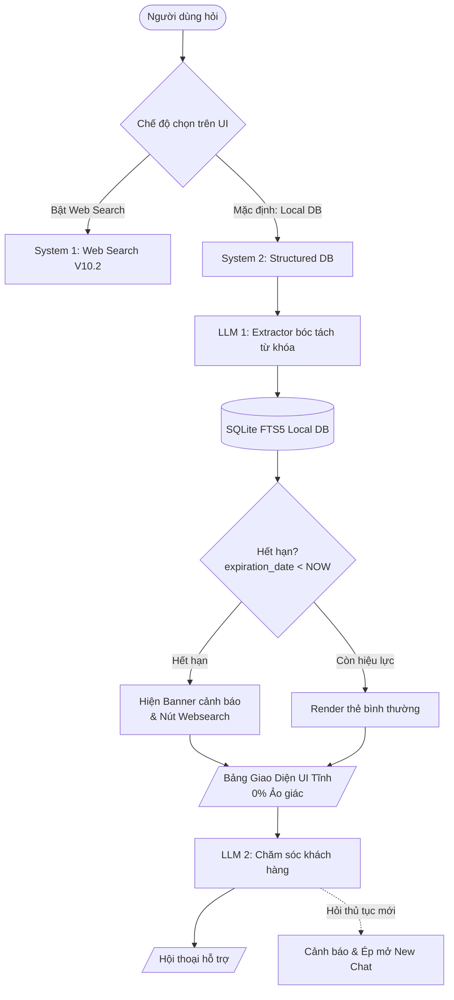
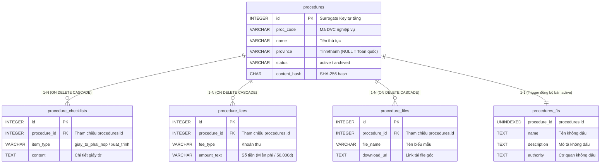

# KIẾN TRÚC SYSTEM 2: LOCAL STRUCTURED DATABASE RETRIEVAL (BẢN GỌN)

Tài liệu tóm tắt kiến trúc kỹ thuật, luồng vận hành và lược đồ cơ sở dữ liệu **System 2** (Tra cứu CSDL hành chính nội bộ) của Nhóm 7.

---

## 1. Kiến trúc Tổng thể & Luồng Dữ liệu

Hệ thống vận hành theo cơ chế **Dual-System (2 Hệ thống song song)**, có nút gạt chuyển đổi trên UI:
- **System 2 (Mặc định - Local DB):** Tra cứu từ CSDL SQLite FTS5 chuẩn hóa nội bộ. Trả kết quả dạng bảng tĩnh (0% ảo giác).
- **System 1 (Fallback - Web Search V10.2):** Cào web DuckDuckGo khi người dùng chủ động yêu cầu hoặc luật nội bộ đã hết hạn.



---

## 2. Các Quyết định Kỹ thuật Cốt lõi

1. **Zero-Hallucination ở bước hiển thị:**
   - Dữ liệu thủ tục (hồ sơ, lệ phí, thời hạn, nơi nộp, biểu mẫu) được đọc trực tiếp từ Database và render thẳng ra bảng HTML.
   - LLM hoàn toàn không tham gia biên soạn câu trả lời ở lượt 1, triệt tiêu 100% nguy cơ bịa đặt.
2. **Ưu tiên Local với SQLite FTS5 (Thay vì PostgreSQL):**
   - Không cần cài Docker hay cấu hình service phức tạp, toàn bộ CSDL nằm gọn trong 1 file `procedures.db`.
   - Tokenizer `unicode61 remove_diacritics 2` cho phép tìm kiếm tiếng Việt không dấu siêu tốc (< 3ms).
3. **Phân định trách nhiệm Fuzzy Match (Lỗi chính tả / Teencode):**
   - Không dùng `pg_trgm`. Trách nhiệm dịch câu hỏi lủng củng / teencode thành tên thủ tục chuẩn được giao cho **LLM 1 (Extractor)**.
   - Database chỉ làm nhiệm vụ đối sánh từ khóa chính xác và bỏ dấu.
4. **Cơ chế Versioning an toàn (Chống xung đột khóa chính):**
   - Tách rời Khóa kỹ thuật tự tăng (`id`) và Mã dịch vụ công nghiệp vụ (`proc_code`).
   - Sử dụng **Partial Unique Index** `(proc_code, IFNULL(province, 'ALL')) WHERE status = 'active'` để lưu trữ lịch sử vô hạn các bản ghi cũ (`archived`) mà không bị lỗi trùng khóa.
5. **Đồng bộ bảng ảo FTS5 bằng SQLite Triggers:**
   - Dùng 3 Triggers tự động (Insert, Update status, Delete) để FTS5 luôn đồng bộ với bảng chính. Khi bản ghi chuyển sang `archived`, Trigger tự động gỡ khỏi FTS5 để người dùng không search trúng luật cũ.
6. **Tự động cảnh báo luật hết hạn:**
   - Nếu `expiration_date < CURRENT_DATE`, giao diện tự động bật Banner cảnh báo màu cam kèm nút chuyển sang System 1 (Websearch) để tra cứu văn bản thay thế.
7. **Quy ước `province` & `facet`:**
   - `province`: Ưu tiên bản ghi riêng của địa phương; nếu không có, fallback về bản ghi trung ương (`province IS NULL`).
   - `facet`: Giao diện luôn render Full Card để người dân nắm trọn bộ hồ sơ, nhưng dùng `facet` để Highlight/Auto-scroll khối nội dung được hỏi và định hướng câu chào của LLM 2.

---

## 3. Mô Hình Quan Hệ Dữ Liệu (Entity Relationship)

CSDL `procedures.db` vận hành theo mô hình **Cha – Con (1 – N)** xoay quanh bảng trung tâm `procedures`:



- **`procedures` (Bảng Cha):** Lưu trữ định danh, thông tin pháp lý, thời hạn và trạng thái của thủ tục.
- **3 Bảng Con (`checklists`, `fees`, `files`):** Nối với bảng cha qua khóa ngoại `procedure_id REFERENCES procedures(id)`. Khi xóa thủ tục cha, toàn bộ dữ liệu con tự động bị xóa theo nhờ `ON DELETE CASCADE`.
- **`procedures_fts` (Bảng Ảo FTS5):** Quan hệ 1 – 1 chỉ với các bản ghi đang `active`. Được 3 Triggers tự động cập nhật/gỡ bỏ ngầm để phục vụ tìm kiếm toàn văn không dấu siêu tốc.

---

## 4. Nguồn Gốc & Lịch Sử CSDL Tạm Thời (`normalized_procedures.json`)

> [!NOTE]
> **Lịch sử hình thành qua các phiên bản (Gia phả dữ liệu):**
> 1. **Giai đoạn khởi thủy (Bản V1 – V5):** Dữ liệu xuất phát từ 2 file Excel: `dataset.xlsx` (42 thủ tục UBND phường Tăng Nhơn Phú nhập tay từ Google Form) + `data_crawl.xlsx` (28 thủ tục cấp tỉnh/trung ương cào online). Hai file này được gộp tại commit `183e551` thành `data/data_merged.xlsx` (đúng 70 thủ tục).
> 2. **Chính thức xuất hiện ở Nhánh REVAMP (v6):** Tại commit `9f209ce` (14/09/2026), nhóm chuyển sang kiến trúc Hybrid Retrieval (SBERT + BM25) nên đã chuẩn hóa bảng Excel trên thành file JSON cấu trúc đặt tên là **`data/normalized_procedures.json`**. File này từng làm "trái tim" nạp 210 vector views vào ChromaDB của hệ RAG cũ.
> 3. **Nhánh RE-IMAGINE (V10 – V10.1):** Nhóm chuyển sang cào live DuckDuckGo nên file này tạm thời bị "đóng băng" trong thư mục `data/`.
> 4. **Hôm nay (V10.2 – System 2):** Được tái sử dụng làm **Dữ liệu mồi (Seed Data)**, nạp thẳng vào SQLite FTS5 thông qua `importer.py` để giúp team vượt tiến độ kiểm thử giao diện và truy vấn ngay trong ngày Thứ 2.

**4 Giới hạn chất lượng kế thừa từ dữ liệu cũ (Cần crawler bổ sung ở Thứ 3):**
1. **Mã thủ tục tạm thời:** Đang dùng mã tự sinh `LEGACY-PROC-0001` đến `LEGACY-PROC-0070` thay vì mã chính thức của Cổng Dịch vụ công Quốc gia (`T-BTP-...`).
2. **Thẩm quyền giải quyết:** Một số thủ tục toàn quốc bị gán cứng cơ quan giải quyết là *"UBND phường Tăng Nhơn Phú"*.
3. **Căn cứ pháp lý:** Chưa có trường `meta_source` đầy đủ (số hiệu Luật, Nghị định ban hành).
4. **Biểu mẫu đính kèm:** Bảng `procedure_files` hiện tại có 0 bản ghi (chưa có đường dẫn tải file biểu mẫu thật).

---

## 5. Kế hoạch Hành động Tuần

| Ngày | Mục tiêu chính | Trạng thái |
|---|---|---|
| **Thứ 2** | Chốt Schema SQLite FTS5, nạp 70 thủ tục mẫu có sẵn vào `procedures.db` | ✅ **Đã hoàn thành trước tiến độ** |
| **Thứ 3** | Viết module cào dữ liệu (`crawler/`) bổ sung các thủ tục mới từ Cổng DVC | Chờ triển khai |
| **Thứ 4** | Dựng API Backend (Query SQLite $\rightarrow$ Render UI Table) + Nút chuyển System 1/2 | Trọng tâm tiếp theo |
| **Thứ 5** | Ghép nối LLM 1 (Extractor) và LLM 2 (Customer Care); chặn hỏi lệch chủ đề | Trọng tâm tiếp theo |
| **Thứ 6** | Tổng duyệt Demo hoàn chỉnh trên `D:\reimagine_V10.2` trước Mentor | Demo cuối tuần |

---

## 6. Phụ lục Mã Nguồn (Code Chi Tiết)

### 6.1. Lược đồ Cơ sở Dữ liệu & Triggers (`schema.sql`)
```sql
-- 1. BẢNG THỦ TỤC CHÍNH
CREATE TABLE procedures (
    id INTEGER PRIMARY KEY AUTOINCREMENT,
    proc_code VARCHAR(64) NOT NULL,
    name VARCHAR(512) NOT NULL,
    normalized_name VARCHAR(512),
    domain VARCHAR(128) NOT NULL,
    level VARCHAR(64),
    province VARCHAR(64) DEFAULT NULL,
    description TEXT,
    duration_desc VARCHAR(255),
    authority VARCHAR(255),
    meta_source TEXT,
    effective_date DATE,
    expiration_date DATE,
    status VARCHAR(32) DEFAULT 'active',
    content_hash CHAR(64) NOT NULL,
    created_at TIMESTAMP DEFAULT CURRENT_TIMESTAMP,
    updated_at TIMESTAMP DEFAULT CURRENT_TIMESTAMP
);

CREATE UNIQUE INDEX idx_proc_unique_active 
ON procedures(proc_code, IFNULL(province, 'ALL')) 
WHERE status = 'active';

-- 2. BẢNG CHECKLIST HỒ SƠ
CREATE TABLE procedure_checklists (
    id INTEGER PRIMARY KEY AUTOINCREMENT,
    procedure_id INTEGER NOT NULL REFERENCES procedures(id) ON DELETE CASCADE,
    step_order INT DEFAULT 1,
    item_type VARCHAR(32) NOT NULL,
    content TEXT NOT NULL,
    note TEXT
);

-- 3. BẢNG LỆ PHÍ
CREATE TABLE procedure_fees (
    id INTEGER PRIMARY KEY AUTOINCREMENT,
    procedure_id INTEGER NOT NULL REFERENCES procedures(id) ON DELETE CASCADE,
    fee_type VARCHAR(255) NOT NULL,
    amount_text VARCHAR(128) NOT NULL,
    condition TEXT
);

-- 4. BẢNG BIỂU MẪU ĐÍNH KÈM
CREATE TABLE procedure_files (
    id INTEGER PRIMARY KEY AUTOINCREMENT,
    procedure_id INTEGER NOT NULL REFERENCES procedures(id) ON DELETE CASCADE,
    file_name VARCHAR(255) NOT NULL,
    download_url TEXT NOT NULL,
    file_size VARCHAR(64)
);

-- 5. BẢNG ẢO FTS5 & TRIGGERS ĐỒNG BỘ TỰ ĐỘNG
CREATE VIRTUAL TABLE procedures_fts USING fts5(
    procedure_id UNINDEXED,
    name,
    normalized_name,
    description,
    authority,
    tokenize = 'unicode61 remove_diacritics 2'
);

CREATE TRIGGER trg_procedures_after_insert AFTER INSERT ON procedures
WHEN NEW.status = 'active'
BEGIN
    INSERT INTO procedures_fts(procedure_id, name, normalized_name, description, authority)
    VALUES (NEW.id, NEW.name, NEW.normalized_name, NEW.description, NEW.authority);
END;

CREATE TRIGGER trg_procedures_after_update_status AFTER UPDATE OF status ON procedures
BEGIN
    DELETE FROM procedures_fts WHERE procedure_id = OLD.id AND NEW.status = 'archived';
    INSERT INTO procedures_fts(procedure_id, name, normalized_name, description, authority)
    SELECT NEW.id, NEW.name, NEW.normalized_name, NEW.description, NEW.authority
    WHERE NEW.status = 'active' AND NOT EXISTS (SELECT 1 FROM procedures_fts WHERE procedure_id = NEW.id);
END;

CREATE TRIGGER trg_procedures_after_delete AFTER DELETE ON procedures
BEGIN
    DELETE FROM procedures_fts WHERE procedure_id = OLD.id;
END;
```

### 6.2. Thuật toán Content Hashing (`importer.py`)
```python
import hashlib
import json

def calculate_content_hash(data: dict) -> str:
    """Băm SHA-256 toàn bộ trường cốt lõi để phát hiện thay đổi nội dung."""
    payload = {
        "proc_code": data.get("proc_code"),
        "name": data.get("name", "").strip(),
        "province": data.get("province"),
        "description": data.get("description", "").strip(),
        "authority": data.get("authority", "").strip(),
        "meta_source": data.get("meta_source", "").strip(),
        "effective_date": str(data.get("effective_date", "")),
        "checklists": sorted([f"{c.get('item_type')}:{c.get('content', '').strip()}" for c in data.get("checklists", [])]),
        "fees": sorted([f"{f.get('fee_type')}:{f.get('amount_text', '').strip()}:{f.get('condition', '')}" for f in data.get("fees", [])]),
        "files": sorted([f"{fl.get('file_name')}:{fl.get('download_url')}" for fl in data.get("files", [])])
    }
    raw_str = json.dumps(payload, sort_keys=True, ensure_ascii=False)
    return hashlib.sha256(raw_str.encode("utf-8")).hexdigest()
```

### 6.3. Cấu trúc Thẻ Giao diện HTML (UI Table Card)
```html
<div class="procedure-card" data-proc-id="T-BTP-282384-TT">
  <!-- Header -->
  <div class="proc-header">
    <h3 class="proc-title">📋 Đăng ký kết hôn</h3>
    <span class="proc-badge badge-domain">Hộ tịch</span>
    <span class="proc-badge badge-scope">Áp dụng: Toàn quốc</span>
  </div>

  <!-- Banner cảnh báo luật hết hạn (Chỉ hiện khi expiration_date < CURRENT_DATE) -->
  <div class="proc-alert-expired" style="display: none;">
    ⚠️ Quy định này đã hết hiệu lực. Vui lòng sử dụng Web Search để tra cứu văn bản thay thế.
  </div>

  <!-- Thông tin tổng quan -->
  <div class="proc-section proc-overview">
    <p><strong>Cơ quan giải quyết:</strong> UBND cấp xã/phường nơi cư trú.</p>
    <p><strong>Thời hạn giải quyết:</strong> Trong ngày làm việc.</p>
  </div>

  <!-- Lệ phí (Gắn class highlight-facet nếu facet='le_phi') -->
  <div class="proc-section proc-fees">
    <h4>💰 Lệ phí:</h4>
    <div class="fee-item">Miễn phí (Công dân Việt Nam cư trú trong nước)</div>
  </div>

  <!-- Checklist tương tác (tick được trực tiếp) -->
  <div class="proc-section proc-checklist">
    <h4>📑 Checklist hồ sơ cần chuẩn bị:</h4>
    <label><input type="checkbox"> Tờ khai đăng ký kết hôn theo mẫu</label>
    <label><input type="checkbox"> Bản chính Giấy xác nhận tình trạng hôn nhân</label>
    <label><input type="checkbox"> Xuất trình CCCD / Thẻ Căn cước / VNeID mức 2</label>
  </div>

  <!-- Biểu mẫu đính kèm -->
  <div class="proc-section proc-files">
    <h4>📥 Biểu mẫu đính kèm:</h4>
    <a href="https://dichvucong.gov.vn/..." download>📄 To_khai_ket_hon.docx</a>
  </div>

  <!-- Footer & Fallback sang System 1 -->
  <div class="proc-footer">
    <small>⚖️ Căn cứ: Luật Hôn nhân & Gia đình 2014</small>
    <button class="btn-switch-s1" onclick="triggerWebSearch('Đăng ký kết hôn')">
      🌐 Tra cứu Web trực tiếp (System 1)
    </button>
  </div>
</div>
```
