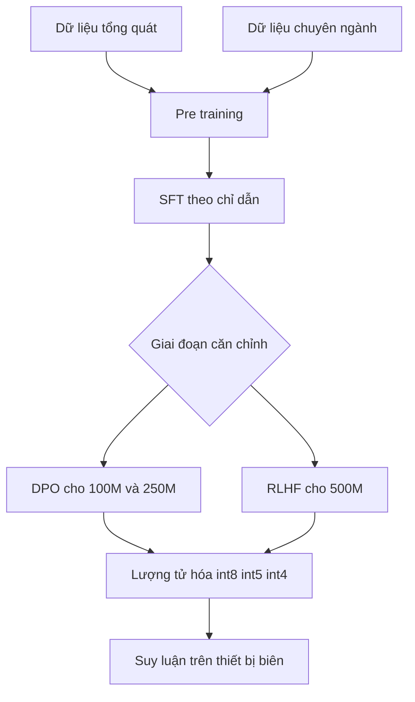

# Tóm tắt bài báo *Fine-Tuning Small Language Models for Domain-Specific AI: An Edge AI Perspective*

## (1) Tóm tắt tổng quan

Bài báo “Fine-Tuning Small Language Models for Domain-Specific AI: An Edge AI Perspective” trình bày dòng mô hình ngôn ngữ nhỏ Shakti-SLM, gồm Shakti-100M, Shakti-250M và Shakti-500M, được thiết kế cho các kịch bản trí tuệ nhân tạo biên, trong đó mô hình phải hoạt động trực tiếp trên điện thoại thông minh, thiết bị IoT, thiết bị đeo, máy bay không người lái, Raspberry Pi hoặc các hệ thống có tài nguyên tính toán hạn chế. Luận điểm trung tâm của bài báo là số lượng tham số không phải yếu tố duy nhất quyết định chất lượng mô hình; một mô hình nhỏ nhưng được thiết kế kiến trúc phù hợp, huấn luyện trên dữ liệu được tuyển chọn, tinh chỉnh theo miền và lượng tử hóa đúng cách vẫn có thể đạt hiệu năng cạnh tranh với những mô hình lớn hơn trong các nhiệm vụ thực tế [Shakhadri et al., 2025].

Dòng Shakti được xây dựng trên nền tảng các ý tưởng từ Shakti-2.5B, nhưng được điều chỉnh cho các giới hạn nghiêm ngặt hơn về bộ nhớ, điện năng và tốc độ suy luận. Shakti-100M hướng tới các ứng dụng siêu nhẹ như IoT, đồng hồ thông minh và thiết bị điện tử tiêu dùng; Shakti-250M tập trung vào các miền tài chính, y tế và pháp lý; còn Shakti-500M được định hướng cho những nhiệm vụ phức tạp hơn, bao gồm hội thoại nhiều lượt, xử lý ngữ cảnh dài, tác vụ đa ngôn ngữ và các ứng dụng pháp lý. Ba mô hình lần lượt có quy mô 100M, 250M và 500M tham số [Shakhadri et al., 2025].

Phương pháp của bài báo kết hợp bốn lớp thành phần. Thứ nhất là kiến trúc hiệu quả, bao gồm Rotary Positional Embeddings, Variable Grouped Query Attention, Block Sparse Attention, hàm kích hoạt SiLU, Pre-Normalization và cơ chế Sliding Window. Thứ hai là quy trình huấn luyện theo nhiều giai đoạn, gồm pre-training, Supervised Fine-Tuning, sau đó là Direct Preference Optimization hoặc Reinforcement Learning from Human Feedback. Thứ ba là huấn luyện và triển khai ở độ chính xác thấp, với các định dạng int8, int5 và int4. Thứ tư là đánh giá Responsible AI trên các bộ dữ liệu về thiên lệch, độc tính và ngôn ngữ thù ghét tiềm ẩn [Shakhadri et al., 2025].

Kết quả được báo cáo cho thấy các mô hình Shakti có thể đạt thông lượng cao trên cả phần cứng mạnh và phần cứng biên. Chẳng hạn, Shakti-500-Q4 đạt 583.88 tokens per second trên GPU NVIDIA L40s, 72.02 tokens per second trên CPU Intel Xeon Platinum 8488C, 29.54 tokens per second trên Raspberry Pi 5 và 62.4 tokens per second trên iPhone 14. Trên iPhone 14, Shakti-100-Q4 đạt 153.7 tokens per second. Trong đánh giá miền, Shakti-250M đạt Answer Relevancy 0.85 trong y tế, 0.86 trong tài chính và 0.81 trong pháp lý; điểm tóm tắt pháp lý là 0.86 và điểm factual accuracy trong tài chính là 0.83 [Shakhadri et al., 2025].

Tuy nhiên, bài báo chủ yếu mô tả thiết kế, quy trình và kết quả tổng hợp từ các hình, bảng và phép đo thông lượng. Một số thông tin quan trọng cho việc tái lập, chẳng hạn chi tiết cấu hình huấn luyện, số epoch, learning rate, kích thước chính xác của từng tập dữ liệu, độ trễ đầu-cuối, mức tiêu thụ điện, chi phí huấn luyện và kết quả số cụ thể trên từng benchmark học thuật, không được trình bày đầy đủ trong phần văn bản được cung cấp. Vì vậy, các tuyên bố rằng Shakti “vượt qua” mô hình lớn hơn cần được hiểu trong phạm vi các benchmark và hình minh họa mà bài báo đã báo cáo, không nên mở rộng thành kết luận phổ quát cho mọi nhiệm vụ.

---

## (2) Bối cảnh và động lực

Bài báo bắt đầu từ sự thành công của các mô hình ngôn ngữ lớn như GPT-3 và LLaMA. Những mô hình này có năng lực mạnh trong tóm tắt, hỏi đáp, dịch máy, hội thoại và sinh văn bản, nhưng thường yêu cầu cụm GPU lớn, dung lượng bộ nhớ đáng kể và kết nối mạng ổn định. Các yêu cầu đó khiến chúng khó triển khai trực tiếp trên thiết bị có công suất, dung lượng lưu trữ và năng lực tính toán hạn chế. Trong những ứng dụng như máy bay không người lái tự hành, dịch vụ y tế di động hoặc hệ thống doanh nghiệp triển khai tại chỗ, vấn đề không chỉ là chi phí tính toán mà còn là quyền riêng tư và độ tin cậy khi phụ thuộc vào máy chủ từ xa [Shakhadri et al., 2025].

Edge AI được bài báo xem là hướng giải quyết bằng cách đưa mô hình đến gần nơi dữ liệu được tạo ra. Suy luận cục bộ có thể giảm phụ thuộc vào đám mây, hạn chế việc truyền dữ liệu nhạy cảm, cải thiện khả năng hoạt động khi mạng không ổn định và có tiềm năng giảm độ trễ. Tuy vậy, việc đơn giản cắt giảm kích thước của một mô hình lớn thường làm suy giảm đáng kể khả năng hiểu ngôn ngữ và chất lượng đầu ra. Vì thế, Small Language Models không chỉ là những mô hình lớn bị thu nhỏ, mà cần được thiết kế ngay từ đầu để cân bằng giữa năng lực biểu diễn và giới hạn phần cứng [Shakhadri et al., 2025].

Bài báo đặt Shakti trong dòng nghiên cứu gồm ba hướng. Hướng thứ nhất là tối ưu kiến trúc, chẳng hạn cơ chế chú ý thưa của BigBird và Grouped Query Attention nhằm giảm chi phí bộ nhớ. Hướng thứ hai là nén mô hình bằng pruning, knowledge distillation và quantization. Hướng thứ ba là tinh chỉnh hiệu quả, bao gồm SFT, RLHF và DPO. So với những mô hình như Mistral 7B, dù có hiệu quả hơn nhiều mô hình lớn, một mô hình 7B vẫn thường quá lớn cho cảm biến thông minh, ASIC di động hoặc các thiết bị chạy bằng pin. Các mô hình như SmolLM và Boomer cố gắng nén hoặc chưng cất tri thức, trong khi Shakti tập trung tái thiết kế kiến trúc và quy trình huấn luyện ở quy mô nhỏ hơn [Shakhadri et al., 2025].

Động lực thứ hai là tính chuyên biệt theo miền. Một mô hình nhỏ tổng quát có thể không đủ kiến thức hoặc độ chính xác cho các lĩnh vực như chăm sóc sức khỏe, tài chính và pháp lý. Bài báo vì vậy nhấn mạnh việc đưa dữ liệu chuyên ngành vào pre-training của Shakti-250M, sau đó tinh chỉnh bằng các tập dữ liệu chỉ dẫn và dữ liệu ưu tiên. Cách tiếp cận này nhằm tạo ra mô hình có thể xử lý những tác vụ như hỏi đáp y tế, phân tích tài chính, phân tích hợp đồng và tư vấn pháp lý mà không cần gửi dữ liệu nhạy cảm lên đám mây [Shakhadri et al., 2025].

Động lực thứ ba là Responsible AI. Khi mô hình nhỏ được tích hợp vào sản phẩm tiêu dùng và các quy trình nhạy cảm, các vấn đề về thiên lệch, độc tính, ngôn ngữ thù ghét và bảo mật trở nên quan trọng không kém độ chính xác. Bài báo sử dụng BBQ, ToxiGen, Implicit Hate Speech Dataset và CrowS-Pairs để khảo sát các khía cạnh này. Đồng thời, xử lý tại thiết bị và lượng tử hóa được trình bày như những yếu tố có thể góp phần giảm rủi ro rò rỉ dữ liệu và giảm dấu chân carbon, dù bài báo không đưa ra phép đo định lượng trực tiếp về điện năng hoặc phát thải carbon [Shakhadri et al., 2025].

---

## (3) Phương pháp

### Kiến trúc ba quy mô của Shakti

Shakti-100M có 10 layers và hidden dimension 640, hướng tới các ứng dụng siêu nhẹ như IoT và thiết bị di động. Shakti-250M có 16 layers và hidden dimension 1024, được định hướng cho các nhiệm vụ chuyên ngành trong tài chính và y tế. Shakti-500M có 24 layers và hidden dimension 2048, phục vụ các tác vụ phức tạp hơn, bao gồm xử lý đa ngôn ngữ và pháp lý. Ba quy mô này phản ánh chiến lược phân bổ mô hình theo ngân sách tính toán thay vì sử dụng một mô hình duy nhất cho mọi thiết bị [Shakhadri et al., 2025].

Shakti-100M và Shakti-250M sử dụng Variable Grouped Query Attention để giảm số lượng phép chiếu key-value. Shakti-500M sử dụng Block Sparse Attention nhằm xử lý ngữ cảnh dài hiệu quả hơn. Cả dòng mô hình tích hợp Rotary Positional Embeddings để hỗ trợ mô hình hóa chuỗi dài mà không làm tăng số lượng tham số. Hàm kích hoạt SiLU và Pre-Normalization được sử dụng nhằm tăng tính ổn định huấn luyện, đặc biệt trong các mô hình quy mô nhỏ. Ngoài ra, cơ chế Sliding Window, lấy cảm hứng từ Longformer, cho phép tái sử dụng attention cache khi xử lý đầu vào dài và giảm chi phí bộ nhớ [Shakhadri et al., 2025].

Có thể khái quát pipeline của bài báo như sau:

### Pre-training trên dữ liệu tổng quát và chuyên ngành

Pre-training sử dụng mục tiêu dự đoán token tiếp theo trên các tập văn bản đa dạng. Mục tiêu là giúp mô hình học cấu trúc ngôn ngữ, ngữ pháp, quan hệ ngữ nghĩa, phụ thuộc ngữ cảnh và tri thức tổng quát. Các nguồn được nêu gồm Common Crawl và những bộ dữ liệu được tuyển chọn. Đối với Shakti-250M, dữ liệu chuyên ngành được đưa trực tiếp vào pre-training nhằm tăng khả năng thích ứng với y tế, tài chính và pháp lý [Shakhadri et al., 2025].

Shakti-100M được báo cáo là được huấn luyện trên một tập pre-training có quy mô 1T tokens. Bài báo cho rằng đây là mức cân bằng, vì tập dữ liệu quá lớn hoặc quá nhỏ đều có thể khiến mô hình khó đạt hiệu quả tối ưu. Tuy nhiên, bài báo không cung cấp trong phần văn bản tổng số token riêng cho Shakti-250M và Shakti-500M, cũng không trình bày phân bố phần trăm giữa dữ liệu tổng quát và dữ liệu chuyên ngành.

Các bộ dữ liệu pre-training được liệt kê trong Bảng 1 gồm Common Crawl, Fineweb-EDU-Dedup, TxT360, AIR-Bench/qa_finance_en và Vidhaan/LegalCitationWorthiness. Cách trình bày trong bài cho thấy dữ liệu được phân bổ khác nhau theo từng mô hình, nhưng bảng văn bản bị định dạng theo cột nên không phải mọi quan hệ giữa từng tập dữ liệu và từng mô hình đều được diễn giải chi tiết trong phần thân bài. Vì vậy, không nên suy ra rằng cả ba mô hình đều được huấn luyện trên toàn bộ danh sách này với cùng khối lượng.

### Supervised Fine-Tuning

Sau pre-training, tất cả mô hình được tinh chỉnh có giám sát trên dữ liệu instruction-specific và task-specific có nhãn. SFT chuyển năng lực ngôn ngữ nền tảng thành khả năng làm theo chỉ dẫn, trả lời hội thoại và xử lý tác vụ chuyên ngành. Các nguồn SFT của Shakti-100M gồm Cosmopedia v2, Magma-Pro-300K-Filtered-H4, OpenHermes-2.5-H4, Self-oss-instruct-sc2-H4, Everyday-conversations-llama3.1-2k và Instruct-data-basics-smolim-H4.

Với Shakti-250M, dữ liệu SFT bao gồm lavita/medical-qa-datasets, ruslannmv/ai-medical-chatbot, axion/pmc llama instructions, windupdate/reddit finance 43 250k, Marina-C/question-answer-Subject-Finance-instruct, isacus/open-australian-legal-qa và mb7419/legal-advice-reddit. Danh sách này phản ánh sự kết hợp giữa hỏi đáp y tế, hội thoại y khoa, tài chính, pháp lý và nội dung tư vấn. Shakti-500M sử dụng The Thome, Infinity-instruct và các nguồn instruction khác được liệt kê trong Bảng 1, hướng tới problem-solving, hội thoại và coding [Shakhadri et al., 2025].

Bài báo không nêu số lượng mẫu, tỷ lệ train-validation-test, độ dài chuỗi, số epoch, learning rate hoặc batch size của các giai đoạn SFT. Do đó, vai trò của SFT được mô tả rõ về mặt khái niệm nhưng chưa đủ chi tiết để tái lập chính xác.

### DPO và RLHF

Shakti-100M và Shakti-250M sử dụng Direct Preference Optimization. DPO được lựa chọn vì có thể căn chỉnh mô hình với ưu tiên của người dùng mà không cần toàn bộ quy trình RLHF phức tạp. Các tập dữ liệu DPO được nêu gồm UltraFeedback Binarized cho Shakti-100M, NickyNicky/nano finance 200k cho Shakti-250M và Dhananjay22/legal-dpo cho dữ liệu pháp lý. Theo lập luận của bài báo, DPO giúp giảm chi phí tính toán, tạo ra phản hồi chất lượng cao trong thời gian thực và phù hợp với thiết bị di động hoặc IoT [Shakhadri et al., 2025].

Shakti-500M sử dụng RLHF với UltraFeedback Binarized. Phản hồi của người đánh giá được dùng để điều chỉnh mức độ liên quan, mạch lạc và chính xác của câu trả lời. Bài báo xem RLHF là phù hợp hơn cho mô hình lớn nhất trong dòng khi phải xử lý hội thoại nhiều lượt và các nhiệm vụ đòi hỏi sắc thái giống con người.

Tuy nhiên, bài báo không báo cáo con số chi phí huấn luyện, số GPU-giờ, thời gian huấn luyện hoặc mức giảm chi phí cụ thể giữa DPO và RLHF. Vì vậy, nhận định DPO “rẻ hơn đáng kể” chỉ được trình bày như một ưu điểm phương pháp luận, không phải là một so sánh chi phí thực nghiệm với giá trị tiền tệ hoặc số giờ tính toán.

### Lượng tử hóa và tối ưu suy luận

Bài báo chuyển trọng số từ FP32 sang các định dạng int8, int5 và int4. Kỹ thuật được mô tả gồm lượng tử hóa theo block với hệ số scale, các định dạng Q4_0, Q4_1, Q5_0, Q5_1 và Q8_0, cùng việc gán hệ số scale riêng cho từng block trọng số. Memory mapping bằng mmap cho phép truy cập trọng số trực tiếp từ đĩa nhằm giảm mức sử dụng RAM. Các tối ưu phụ thuộc phần cứng như AVX2 và ARM NEON được dùng để tăng tốc suy luận [Shakhadri et al., 2025].

Hình 5 cho thấy các mô hình Q4 cần xấp xỉ ít hơn 8 lần bộ nhớ so với phiên bản FP32. Đây là con số giảm footprint bộ nhớ được bài báo báo cáo, không phải tỷ lệ giảm thời gian suy luận hay mức tiêu thụ điện. Bài báo cũng không đưa ra bảng đầy đủ về kích thước tệp tính theo MB hoặc GB cho từng mô hình ở từng mức FP32, Q8, Q5 và Q4.

### Đánh giá Responsible AI

Responsible AI được đánh giá bằng BBQ, ToxiGen, Implicit Hate Speech Dataset và CrowS-Pairs. BBQ đo thiên lệch trong hỏi đáp liên quan đến giới, chủng tộc và tôn giáo. ToxiGen đánh giá khả năng phát hiện nội dung độc hại trên 13 nhóm thiểu số. Implicit Hate Speech Dataset tập trung vào ngôn ngữ thù ghét được diễn đạt gián tiếp. CrowS-Pairs đo thiên lệch khuôn mẫu theo tuổi, khuyết tật, giới và chủng tộc thông qua Likelihood Difference và Percentage of Stereotypes [Shakhadri et al., 2025].

---

## (4) Thực nghiệm

Bài báo thực hiện ba nhóm đánh giá: benchmark học thuật tổng quát, đánh giá miền chuyên ngành và đánh giá Responsible AI. Các baseline được sử dụng thay đổi theo kích thước mô hình. Với Shakti-100M, Hình 1 so sánh với Boomer-634M, SmolLM-135M, SmolLM-360M và AMD-Llama-135M. Với Shakti-250M, Hình 2 so sánh với Boomer-1B, Boomer-634M, Qwen2.5-0.5B, SmolLM-360M và Llama 3.2 1B. Với Shakti-500M, Hình 3 so sánh với Boomer-1B, Boomer-634M, Qwen2.5-0.5B và Llama 3.2 1B. Trong phần giới thiệu đánh giá, bài báo cũng đề cập các benchmark tổng quát như MMLU và Hellaswag.

Điểm cần phân biệt là các tên SmolLM-135M, SmolLM-360M, Boomer-634M, Boomer-1B, Qwen2.5-0.5B và Llama 3.2 1B là các baseline so sánh, không phải các bộ dữ liệu huấn luyện của Shakti. Ngược lại, Common Crawl, Fineweb-EDU-Dedup, TxT360, AIR-Bench/qa_finance_en, Cosmopedia v2 và các tập dữ liệu y tế, tài chính, pháp lý là dữ liệu huấn luyện hoặc tinh chỉnh, không phải baseline mô hình.

Đối với benchmark học thuật tổng quát, bài báo khẳng định Shakti-100M có thể “match hoặc outperform” một số mô hình lớn hơn và nhấn mạnh vai trò của tập pre-training 1T tokens. Shakti-250M được mô tả là cạnh tranh hiệu quả với Boomer-1B và Llama 3.2 1B dù có kích thước nhỏ hơn và tập huấn luyện hạn chế hơn. Shakti-500M cũng được mô tả là đạt kết quả cạnh tranh với mô hình cùng cỡ và lớn hơn. Tuy nhiên, trong nội dung văn bản được cung cấp, các giá trị accuracy, F1 hoặc perplexity cụ thể của từng benchmark trong Hình 1, Hình 2 và Hình 3 không được ghi lại. Bài báo cũng không trình bày một bảng số đầy đủ cho MMLU hoặc Hellaswag. Vì vậy, không thể trích dẫn trung thực các con số benchmark học thuật cụ thể ngoài những tuyên bố định tính nói trên.

Đối với đánh giá miền chuyên ngành, Shakti-250M được huấn luyện và đánh giá trong các miền healthcare, finance và legal. Hình 4 so sánh kết quả miền y tế với Phi-1.5-1.3B, Gemma-2B và OPT-2.7B. Bài báo nhận định Shakti-250M thể hiện năng lực tốt trong y tế và tài chính, đặc biệt ở các tác vụ đòi hỏi suy luận y khoa và áp dụng kiến thức lâm sàng. Tuy nhiên, giá trị số cụ thể của các đường hoặc cột trong Hình 4 không được mô tả trong phần văn bản.

Các kết quả prompt-based được báo cáo rõ hơn:

| Miền | Average Answer Relevancy | Summarization Score | Factual Score |
| :--- | :---: | :---: | :---: |
| Healthcare | 0.85 | Không báo cáo | Không báo cáo |
| Legal | 0.81 | 0.86 | Không báo cáo |
| Finance | 0.86 | Không báo cáo | 0.83 |

Bảng trên cho thấy Answer Relevancy của Shakti-250M là 0.85 trong healthcare, 0.81 trong legal và 0.86 trong finance. Điểm Summarization Score trong legal là 0.86, còn Average Factual Score trong finance là 0.83. Bài báo giải thích rằng Answer Relevancy phản ánh mức độ câu trả lời phù hợp với đáp án kỳ vọng; Summarization Score đo mức độ tương hợp và độ bao phủ của bản tóm tắt; còn Factual Score đo tính đúng đắn của thông tin thực tế, trong đó giá trị gần 1 biểu thị kết quả tốt hơn [Shakhadri et al., 2025].

Về thông lượng sau lượng tử hóa, các số liệu cụ thể được báo cáo như sau:

| Phần cứng | Mô hình | Thông lượng |
| :--- | :--- | :---: |
| NVIDIA L40s GPU, AMD EPYC 7R13, 40 GB RAM | Shakti-500-Q4 | 583.88 TPS |
| NVIDIA L40s GPU, AMD EPYC 7R13, 40 GB RAM | SmolLM2-360M-Q4 | 281.98 TPS |
| Intel Xeon Platinum 8488C, 8 cores, 15 GB RAM | Shakti-500-Q4 | 72.02 TPS |
| Intel Xeon Platinum 8488C, 8 cores, 15 GB RAM | Qwen2.5-0.5B-Q4 | 45.89 TPS |
| Apple MacBook Pro M3 Max, 36 GB RAM | Shakti-250-Q4 | 385.00 TPS |
| Raspberry Pi 5, ARM Cortex-A76, 8 GB RAM | Shakti-500-Q4 | 29.54 TPS |
| Raspberry Pi 5, ARM Cortex-A76, 8 GB RAM | SmolLM2-360M-Q4 | 28.99 TPS |
| iPhone 14, A15 Bionic, 6 GB RAM | Shakti-500-Q4 | 62.4 TPS |
| iPhone 14, A15 Bionic, 6 GB RAM | Shakti-100-Q4 | 153.7 TPS |

Các số liệu này cho thấy Shakti-500-Q4 đạt 583.88 TPS so với 281.98 TPS của SmolLM2-360M-Q4 trên NVIDIA L40s; đạt 72.02 TPS so với 45.89 TPS của Qwen2.5-0.5B-Q4 trên Intel Xeon; và đạt 29.54 TPS so với 28.99 TPS của SmolLM2-360M-Q4 trên Raspberry Pi 5. Bài báo không báo cáo latency theo mili-giây cho từng token, latency đầu-cuối, thời gian khởi động, độ trễ sao chép dữ liệu hoặc độ trễ khi xử lý các độ dài ngữ cảnh khác nhau. TPS vì vậy không nên được đồng nhất với độ trễ toàn hệ thống.

Ở đánh giá Responsible AI, Shakti-250M đạt 50.2% accuracy trên BBQ, trong khi Shakti-500M đạt 54.08%. Trên ToxiGen, hai mô hình lần lượt đạt 47.5% và 51.5%. Trên Implicit Hate Speech Dataset, Shakti-250M đạt 63% và Shakti-500M đạt 69.04%. Trên CrowS-Pairs, Shakti-250M có Likelihood Difference 3.11 và Percentage of Stereotypes 52.07%; Shakti-500M có các giá trị tương ứng là 3.02 và 51.9%. Theo cách diễn giải của bài báo, accuracy cao hơn trong ba bộ dữ liệu đầu phản ánh năng lực phân loại hoặc phát hiện tốt hơn, còn giá trị thấp hơn trong hai metric của CrowS-Pairs phản ánh ít thiên lệch hơn [Shakhadri et al., 2025].

Bài báo không báo cáo F1, precision, recall, perplexity, calibration, tỷ lệ hallucination hoặc đánh giá an toàn theo từng loại lỗi. Cũng không có thí nghiệm ablation tách riêng tác động của RoPE, GQA, Block Sparse Attention, Sliding Window, SFT, DPO, RLHF và QAT. Những thiếu hụt này làm cho việc xác định thành phần nào đóng góp nhiều nhất vào kết quả cuối cùng còn hạn chế.

---

## (5) Điểm mạnh của bài báo

Điểm mạnh đầu tiên là bài báo kết nối tương đối rõ giữa thiết kế mô hình và bối cảnh triển khai. Thay vì chỉ công bố một mô hình nhỏ với điểm benchmark, bài báo trình bày một dòng mô hình gồm 100M, 250M và 500M tham số, mỗi phiên bản gắn với một nhóm ứng dụng và ngân sách tính toán khác nhau. Cách phân tầng này có ý nghĩa thực tiễn hơn việc chỉ tối ưu một mô hình duy nhất.

Điểm mạnh thứ hai là sự kết hợp giữa kiến trúc, dữ liệu và quy trình căn chỉnh. GQA, Block Sparse Attention, RoPE, Sliding Window, SiLU và Pre-Normalization được trình bày như một hệ thống thiết kế thống nhất nhằm giảm bộ nhớ và tăng hiệu quả xử lý chuỗi. Đồng thời, bài báo không xem fine-tuning là một bước đơn lẻ mà xây dựng chuỗi pre-training, SFT và DPO hoặc RLHF. Với Shakti-250M, dữ liệu y tế, tài chính và pháp lý được đưa vào cả pre-training hoặc SFT, qua đó phù hợp với mục tiêu domain-specific AI [Shakhadri et al., 2025].

Điểm mạnh thứ ba là đánh giá trên phần cứng đa dạng. Việc đo TPS trên NVIDIA L40s, Intel Xeon Platinum 8488C, Apple MacBook Pro M3 Max, Raspberry Pi 5 và iPhone 14 giúp minh họa khả năng chuyển từ môi trường GPU mạnh sang thiết bị biên. Con số 153.7 TPS của Shakti-100-Q4 trên iPhone 14 và 29.54 TPS của Shakti-500-Q4 trên Raspberry Pi 5 đặc biệt phù hợp với luận điểm triển khai cục bộ.

Điểm mạnh thứ tư là lượng tử hóa không chỉ được nêu như một ý tưởng mà được gắn với các mức int8, int5, int4, các định dạng Q4_0, Q4_1, Q5_0, Q5_1 và Q8_0, mmap cùng tối ưu AVX2 và ARM NEON. Việc báo cáo Q4 sử dụng xấp xỉ ít hơn 8 lần bộ nhớ so với FP32 tạo ra một chỉ dấu trực tiếp về khả năng triển khai.

Điểm mạnh thứ năm là bài báo đưa Responsible AI vào đánh giá thay vì chỉ đề cập ở phần thảo luận. BBQ, ToxiGen, Implicit Hate Speech Dataset và CrowS-Pairs cung cấp một góc nhìn bổ sung về thiên lệch và độc tính. Việc Shakti-500M đạt 54.08% trên BBQ, 51.5% trên ToxiGen, 69.04% trên Implicit Hate Speech Dataset và Likelihood Difference 3.02 trên CrowS-Pairs cho thấy nhóm tác giả cố gắng đánh giá mô hình trên cả năng lực và rủi ro xã hội [Shakhadri et al., 2025].

---

## (6) Hạn chế và thảo luận

Hạn chế lớn nhất là mức độ chi tiết thực nghiệm chưa tương xứng với các tuyên bố mạnh về hiệu năng. Các hình benchmark học thuật được viện dẫn nhưng phần văn bản không cung cấp các giá trị accuracy cụ thể cho từng mô hình và từng task. Bài báo cũng không nêu đầy đủ các giá trị MMLU hoặc Hellaswag, không báo cáo perplexity và không trình bày F1, precision hay recall. Do đó, người đọc khó kiểm tra chính xác mức “vượt qua” giữa Shakti và từng baseline.

Thứ hai, thiết lập thực nghiệm chưa được mô tả đủ để tái lập. Bài báo liệt kê nhiều bộ dữ liệu như Common Crawl, Fineweb-EDU-Dedup, TxT360, Cosmopedia v2, Magma-Pro-300K-Filtered-H4, OpenHermes-2.5-H4, UltraFeedback Binarized, NickyNicky/nano finance 200k và Dhananjay22/legal-dpo, nhưng không cho biết đầy đủ số lượng mẫu, số token sau lọc, tiêu chí khử trùng, tỷ lệ dữ liệu giữa các miền hoặc cách xử lý trùng lặp giữa các giai đoạn. Các siêu tham số huấn luyện như learning rate, batch size, sequence length, số bước và số epoch cũng không được báo cáo trong nội dung được cung cấp.

Thứ ba, bài báo chưa có ablation study. Không có thí nghiệm tách riêng để xác định hiệu quả của GQA so với attention thông thường, Block Sparse Attention so với GQA, RoPE so với positional embedding khác, hay DPO so với không căn chỉnh. Đặc biệt, vì Shakti-100M và Shakti-250M dùng DPO còn Shakti-500M dùng RLHF, việc so sánh chất lượng giữa các kích thước mô hình bị trộn lẫn với khác biệt trong phương pháp căn chỉnh.

Thứ tư, các tuyên bố về chi phí và độ trễ mới chỉ được chứng minh một phần. Bài báo báo cáo TPS và mức giảm bộ nhớ Q4 khoảng 8 lần so với FP32, nhưng không báo cáo chi phí tiền tệ, GPU-hours, mức tiêu thụ điện, nhiệt lượng, thời gian khởi động, latency đầu-cuối hoặc năng lượng trên mỗi token. Vì vậy, bài báo chưa chứng minh định lượng rằng Shakti có chi phí vận hành thấp hơn trong toàn bộ vòng đời hệ thống. TPS cao cũng không tự động cho thấy trải nghiệm tương tác tốt nếu thời gian tải mô hình, độ dài đầu vào hoặc thời gian tạo token đầu tiên lớn.

Thứ năm, việc so sánh phần cứng chưa hoàn toàn đồng nhất. Các thiết bị có kiến trúc CPU, hệ điều hành, bộ nhớ và trình biên dịch khác nhau. Bài báo không nêu rõ cùng một prompt, cùng độ dài ngữ cảnh, cùng batch size, cùng số token sinh ra hay cùng thư viện suy luận được sử dụng trên mọi nền tảng. Vì vậy, các số TPS rất hữu ích để minh họa khả năng triển khai, nhưng chưa đủ để tạo thành phép so sánh kiểm soát chặt chẽ.

Thứ sáu, đánh giá Responsible AI cần được diễn giải thận trọng. Accuracy 54.08% trên BBQ hoặc 51.5% trên ToxiGen không tự nó chứng minh mô hình đã “công bằng” hoặc “an toàn”, bởi còn phụ thuộc vào cách dựng prompt, cân bằng lớp, ngưỡng quyết định và chiến lược đo. Bài báo không cung cấp phân tích theo từng nhóm nhân khẩu học, khoảng tin cậy, sai số thống kê hoặc so sánh với nhiều mô hình khác trên cùng giao thức. Hơn nữa, CrowS-Pairs được báo cáo bằng Likelihood Difference và Percentage of Stereotypes, nhưng bài báo không trình bày chi tiết phân bố lỗi hay các trường hợp đầu ra gây hại.

Thứ bảy, tuy bài báo nhấn mạnh năng lực đa ngôn ngữ, các kết quả định lượng cho Kannada, Hindi, Telugu, Tamil, Spanish, French hoặc German không được báo cáo trong nội dung cung cấp. Tương tự, bài báo đề cập ứng dụng y tế, pháp lý và tài chính nhưng chưa đánh giá độ an toàn khi sử dụng trong các quyết định có hậu quả cao. Những ứng dụng như chẩn đoán bệnh, tư vấn tài chính hoặc tư vấn pháp lý cần cơ chế kiểm chứng, từ chối và giám sát chuyên gia, nhưng các cơ chế đó chưa được mô tả cụ thể.

Cuối cùng, bài báo nêu các hướng tương lai gồm tăng cường ngôn ngữ ít tài nguyên, adaptive pre-training, task-specific fine-tuning, federated learning và continuous learning từ dữ liệu sử dụng thực tế. Đây là các hướng hợp lý, nhưng chúng cũng đặt ra vấn đề mới về quyền riêng tư, trôi dạt dữ liệu, kiểm soát phiên bản mô hình và nguy cơ học phải thông tin sai từ người dùng. Bài báo chưa thực nghiệm các hướng này.

---

## (7) Kết luận và ý nghĩa cho nghiên cứu tiếp theo

Bài báo lập luận rằng các mô hình ngôn ngữ nhỏ có thể trở thành nền tảng quan trọng cho Edge AI nếu được thiết kế đồng thời ở cấp kiến trúc, dữ liệu, fine-tuning và triển khai. Shakti-100M, Shakti-250M và Shakti-500M đại diện cho ba mức đánh đổi khác nhau giữa kích thước, năng lực và chi phí. Shakti-100M phù hợp với thiết bị cực kỳ hạn chế; Shakti-250M nổi bật ở các miền y tế, tài chính và pháp lý; còn Shakti-500M hướng tới hội thoại phức tạp, đa ngôn ngữ và xử lý ngữ cảnh dài [Shakhadri et al., 2025].

Các kết quả quan trọng nhất gồm: Shakti-100M được huấn luyện trên 1T tokens; các mô hình hỗ trợ lượng tử hóa int8, int5 và int4; phiên bản Q4 cần xấp xỉ ít hơn 8 lần bộ nhớ so với FP32; Shakti-500-Q4 đạt 583.88 TPS trên NVIDIA L40s, 72.02 TPS trên Intel Xeon Platinum 8488C và 29.54 TPS trên Raspberry Pi 5; Shakti-100-Q4 đạt 153.7 TPS trên iPhone 14. Trong đánh giá miền, Shakti-250M đạt Answer Relevancy 0.85 ở healthcare, 0.81 ở legal và 0.86 ở finance, cùng Summarization Score 0.86 ở legal và Factual Score 0.83 ở finance. Trong Responsible AI, Shakti-500M đạt 54.08% trên BBQ, 51.5% trên ToxiGen, 69.04% trên Implicit Hate Speech Dataset, Likelihood Difference 3.02 và Percentage of Stereotypes 51.9% trên CrowS-Pairs [Shakhadri et al., 2025].

Ý nghĩa quan trọng của bài báo đối với nghiên cứu tiếp theo là cần đánh giá SLM không chỉ bằng điểm benchmark, mà bằng toàn bộ “hồ sơ triển khai”: chất lượng, bộ nhớ, TPS, latency, năng lượng, chi phí và an toàn. Các nghiên cứu sau nên bổ sung bảng kết quả đầy đủ cho MMLU, Hellaswag và các benchmark miền; báo cáo F1, precision, recall, perplexity và độ tin cậy; công bố siêu tham số huấn luyện; thực hiện ablation cho từng thành phần kiến trúc; và so sánh DPO với RLHF trên cùng dữ liệu, cùng ngân sách tính toán.

Ngoài ra, cần xây dựng giao thức đánh giá phần cứng thống nhất, bao gồm cùng độ dài prompt, cùng batch size, cùng số token sinh ra, thời gian tạo token đầu tiên, latency trung bình, peak memory và năng lượng trên mỗi token. Với các miền nhạy cảm, nghiên cứu tương lai cần đánh giá hallucination, khả năng trích dẫn nguồn, hành vi từ chối, độ bền trước prompt độc hại và mức độ phụ thuộc vào chuyên gia con người. Việc tích hợp federated learning, continuous learning và các ngôn ngữ ít tài nguyên cũng cần đi kèm cơ chế bảo vệ dữ liệu và kiểm soát cập nhật.

Nhìn chung, bài báo đưa ra một định hướng có giá trị: thay vì chạy theo quy mô tham số, có thể đạt AI chuyên ngành thiết thực bằng cách phối hợp mô hình nhỏ, dữ liệu chất lượng, fine-tuning có mục tiêu, căn chỉnh ưu tiên và lượng tử hóa. Tuy nhiên, để Shakti thực sự trở thành chuẩn tham chiếu cho Edge AI, cần thêm các thí nghiệm có kiểm soát, số liệu chi phí và độ trễ đầy đủ, cùng đánh giá độc lập về độ tin cậy và an toàn trong môi trường thực tế.
