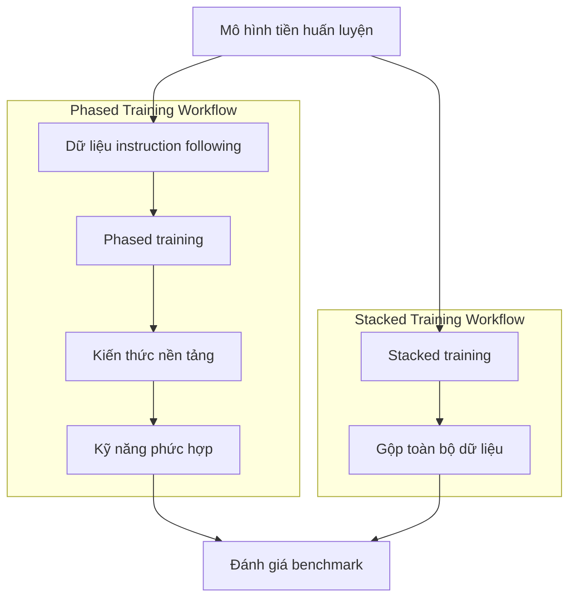

# Tóm tắt bài báo *Unveiling the Secret Recipe: A Guide For Supervised Fine-Tuning Small LLMs*

## (1) Tóm tắt tổng quan

Bài báo *Unveiling the Secret Recipe: A Guide For Supervised Fine-Tuning Small LLMs* nghiên cứu cách tinh chỉnh có giám sát các mô hình ngôn ngữ lớn (LLM) quy mô nhỏ, trong khoảng 3–7 tỷ tham số, bằng dữ liệu instruction-tuning bao phủ kiến thức, khả năng tuân thủ chỉ dẫn và các kỹ năng phức hợp. Vấn đề trung tâm là sự bất cân xứng giữa các phòng thí nghiệm công nghiệp—có nhiều GPU, hạ tầng phân tán và đội ngũ chuyên gia—với cá nhân hoặc tổ chức nhỏ, vốn khó khảo sát không gian siêu tham số và chiến lược huấn luyện rộng lớn.

Đóng góp chính của bài báo là một nghiên cứu thực nghiệm có hệ thống về kích thước batch, tốc độ học, warmup, lịch tốc độ học, chiến lược huấn luyện và động lực học giai đoạn đầu. Nhóm tác giả thử nghiệm trên bốn mô hình nguồn mở: Granite 3B, Granite 7B, Llama 3.2 3B và Mistral 7B; đồng thời công bố cả những cấu hình không hiệu quả hoặc thất bại, thay vì chỉ trình bày cấu hình tốt nhất.

Bốn phát hiện chính của bài báo có thể khái quát như sau:

1. **Batch lớn kết hợp với learning rate thấp thường cho kết quả tốt hơn.** Với Granite 7B, batch hiệu dụng 3.840 và 7.680 mẫu đạt điểm cuối cao hơn batch 128 trên MMLU và MTBench. Trong cấu hình stacked, MMLU tăng từ 0,516 với batch 128 lên 0,526 và 0,529 với batch 3.840 và 7.680; MTBench tăng tương ứng từ 6,406 lên 6,768 và 6,831.
2. **Các chỉ báo động lực học ở giai đoạn đầu có thể dự đoán hiệu năng cuối.** Những lần chạy có gradient norm ban đầu thấp hơn và loss cao hơn thường đạt kết quả cuối tốt hơn, đặc biệt khi dùng learning rate thấp. Mô hình Granite dùng learning rate $2 \times 10^{-5}$ có gradient norm ban đầu thấp, loss cao hơn và đạt điểm MMLU/MTBench tốt hơn các cấu hình learning rate cao.
3. **Một số thực hành phổ biến có thể được đơn giản hóa.** Warmup không tạo ra cải thiện đáng kể: với Granite 7B, 0 warmup đạt MMLU 0,531, so với 0,528 và 0,526 khi dùng 25 và 100 bước; MTBench giữa các cấu hình gần tương đương. Lịch learning rate cố định cũng đạt kết quả tương đương hoặc tốt hơn cosine decay trên MTBench.
4. **Stacked training không kém phased training và thường hiệu quả mẫu hơn.** Với Granite 7B, stacked đạt MMLU 0,53 và MTBench 6,77, so với 0,52 và 6,76 của phased; số mẫu cần để đạt đỉnh lần lượt là khoảng 3,69 triệu và 4,39 triệu đối với stacked, trong khi phased cần khoảng 7,86–8,06 triệu mẫu. Kết luận này tiếp tục xuất hiện ở Llama 3B, nơi stacked đạt MMLU 0,57 và MTBench 5,00, còn phased đạt 0,53 và 4,30.

---

## (2) Bối cảnh và động lực

LLM nhỏ ngày càng được quan tâm vì có chi phí huấn luyện, tinh chỉnh và triển khai thấp hơn mô hình lớn; chúng có thể vận hành trên phần cứng phổ thông hơn, cho phép cá nhân và doanh nghiệp nhỏ kiểm soát dữ liệu cũng như mô hình sau tinh chỉnh. Quy mô 3–7 tỷ tham số tạo ra một điểm cân bằng giữa năng lực biểu diễn, tốc độ suy luận và khả năng triển khai trong môi trường hạn chế tài nguyên.

Tuy nhiên, khả năng tiếp cận mô hình nhỏ không đồng nghĩa với việc quy trình instruction-tuning đã dễ dàng. Các báo cáo trước đây thường chỉ công bố cấu hình thành công, không mô tả đầy đủ các thử nghiệm không đạt hoặc tác động của batch size và learning rate đến kết quả cuối. Điều này khiến người thực hành khó biết nên bắt đầu từ đâu khi ngân sách tính toán hạn chế.

Instruction-tuning có vai trò đặc biệt quan trọng bởi nó chuyển mô hình tiền huấn luyện từ khả năng dự đoán ngôn ngữ tổng quát sang khả năng hiểu và thực hiện chỉ dẫn. Theo bài báo, quá trình này cải thiện năng lực zero-shot, khả năng tuân thủ yêu cầu và khả năng chuyên biệt hóa theo miền. Dữ liệu kiến thức giúp củng cố độ chính xác sự kiện, còn dữ liệu kỹ năng tập trung vào suy luận, lập trình, giải quyết vấn đề và các năng lực tổng hợp; sự đa dạng này có thể hỗ trợ ghi nhớ, giảm hallucination và tăng khả năng khái quát hóa.

Bài báo tập trung vào một câu hỏi thực tiễn: làm thế nào tinh chỉnh hiệu quả LLM nhỏ trên dữ liệu instruction-tuning đa dạng mà không cần hạ tầng của các phòng thí nghiệm công nghiệp? Đặc biệt, tác giả xem xét liệu việc huấn luyện tuần tự theo các giai đoạn có thực sự tốt hơn việc trộn toàn bộ dữ liệu và huấn luyện trong một giai đoạn hay không.

---

## (3) Phương pháp

### Mô hình và dữ liệu

Bốn mô hình được sử dụng là Granite 3B, Granite 7B, Llama 3.2 3B và Mistral 7B. Granite và Llama dựa trên kiến trúc decoder-only tương tự nhau, trong khi Mistral 7B đại diện cho một họ kiến trúc khác với các tối ưu hóa attention riêng.

Năm nhóm dữ liệu chính gồm:
- Dữ liệu instruction-following cơ bản với **308.343 mẫu**.
- Dữ liệu kiến thức nền tảng với **231.178 mẫu**.
- Dữ liệu kỹ năng phức hợp với **285.966 mẫu**.
- Bộ trộn **TULU v2**, chứa dữ liệu instruction-tuning đa dạng từ nguồn con người và GPT-4.
- Bộ dữ liệu chuyên biệt về **toán học, suy luận và lập trình** (MRC).

Ba nhóm dữ liệu đầu được tổ chức theo taxonomy gồm instruction following, kiến thức nền tảng và kỹ năng phức hợp. Khi gộp lại, tập All-Phases có 825.487 mẫu.

### Hai chiến lược huấn luyện

**Phased training** huấn luyện mô hình tuần tự qua các giai đoạn: trước hết là instruction following đơn giản, sau đó là kiến thức nền tảng, cuối cùng là kỹ năng phức hợp. Sau mỗi giai đoạn, checkpoint tốt nhất được chọn dựa trên chỉ số đánh giá trước khi chuyển sang giai đoạn tiếp theo.

**Stacked training** gộp dữ liệu của các giai đoạn thành một tập duy nhất và cho mô hình tiếp xúc đồng thời với nhiều loại dữ liệu. Cách này loại bỏ việc quản lý checkpoint và lựa chọn thời điểm chuyển pha.

### Siêu tham số

Ba cấu hình chính là LAB, TULU và TULU++. TULU sử dụng batch hiệu dụng 128, warmup ratio 0,03, linear decay và learning rate mục tiêu $2 \times 10^{-5}$; TULU++ dùng learning rate $3 \times 10^{-5}$, không decay và bốn epoch. LAB dùng batch 3.840 hoặc 7.680, warmup ratio 0,01 tương ứng 25 bước warmup tuyến tính, learning rate mục tiêu $2 \times 10^{-5}$ và mười epoch.

Các batch hiệu dụng được khảo sát là 128, 3.840 và 7.680 mẫu. Nhóm tác giả dùng gradient accumulation để mô phỏng batch lớn trên ít GPU hơn; thí nghiệm cũng cho thấy gradient accumulation trên một node cho đường cong loss và kết quả MMLU/MTBench tương đương huấn luyện phân tán với cùng batch hiệu dụng.

Learning rate được quét trong khoảng từ $1 \times 10^{-6}$ đến $1 \times 10^{-4}$, warmup được đặt ở 0, 25 hoặc 100 bước. Với Granite, $2 \times 10^{-5}$ thường là lựa chọn tốt; với Mistral 7B, learning rate tối ưu trong các giá trị thử nghiệm là $1 \times 10^{-6}$.

Bài báo đề xuất theo dõi **gradient norm** và **loss ở giai đoạn đầu**. Một lần chạy có gradient norm thấp hơn, loss cao hơn và đường cong ổn định thường có khả năng đạt hiệu năng cuối tốt hơn; vì vậy, các lần chạy có dấu hiệu bất lợi có thể được dừng sớm để tiết kiệm tính toán.

---

## (4) Thực nghiệm

Các đánh giá chính gồm MMLU, MTBench và Open LLM Leaderboard v2. MMLU đo kiến thức và suy luận trên 57 môn học; MTBench đánh giá hội thoại nhiều lượt, tính phù hợp, tính mạch lạc và khả năng tuân thủ chỉ dẫn. Open LLM Leaderboard v2 bổ sung các bài MMLU-Pro, GPQA, MuSR, MATH, IFEval và BBH; ngoài ra, tác giả còn dùng ARC và GSM8K.

Kết quả trên Granite 7B cho thấy batch lớn có lợi ở hiệu năng cuối. Trong stacked training, batch 128 đạt MMLU 0,516 và MTBench 6,406; batch 3.840 đạt lần lượt 0,526 và 6,768; batch 7.680 đạt 0,529 và 6,831. Tuy nhiên, batch nhỏ thường đạt mức điểm ban đầu nhanh hơn, trong khi batch lớn cần nhiều mẫu hơn để hội tụ nhưng vượt lên khi được huấn luyện đủ lâu.

Với stacked và phased training, stacked nhỉnh hơn trên phần lớn benchmark. Granite 7B đạt MMLU 0,53 và MTBench 6,77 với stacked, so với 0,52 và 6,76 với phased; trên GSM8K, stacked đạt 0,39, còn phased đạt 0,37. Stacked cũng cần khoảng 3,69–4,39 triệu mẫu để đạt đỉnh, thấp hơn đáng kể so với 7,86–8,06 triệu mẫu của phased.

Khi so sánh lịch learning rate, constant learning rate đạt MMLU 0,5242 và MTBench 6,7562, trong khi cosine decay đạt MMLU 0,5251 và MTBench 6,6813. Như vậy, cosine decay chỉ nhỉnh hơn rất nhỏ trên MMLU nhưng kém hơn trên MTBench.

Thử nghiệm chéo trên TULU cho thấy batch 3.840 vượt batch 128 ở MMLU 0,50 so với 0,48, BBH 0,44 so với 0,40 và GSM8K 0,28 so với 0,25; ngoại lệ là TruthfulQA, trong đó batch 128 đạt 0,45 còn batch lớn đạt 0,44. Trên Mistral 7B, batch 4.000 kết hợp learning rate $1 \times 10^{-6}$ cho MTBench 7,33 và điểm trung bình Open LLM Leaderboard v2 là 18,59.

---

## (5) Điểm mạnh của bài báo

Thứ nhất, nghiên cứu có tính hệ thống cao. Tác giả không chỉ thay đổi một siêu tham số đơn lẻ mà khảo sát đồng thời batch size, learning rate, warmup, lịch learning rate, chiến lược dữ liệu và nhiều kiến trúc mô hình.

Thứ hai, bài báo minh bạch hơn nhiều công trình instruction-tuning thông thường khi công bố các cấu hình TULU, LAB, TULU++, các giá trị thử nghiệm và những kết quả không tối ưu. Điều này giúp người thực hành hiểu được sự đánh đổi giữa hiệu năng, số mẫu và chi phí tính toán.

Thứ ba, khung thực nghiệm có khả năng tái lập tương đối tốt. Bài báo nêu rõ kích thước batch, learning rate, warmup, optimizer Adam với $\beta_1 = 0,9$, $\beta_2 = 0,95$, cũng như cách sử dụng gradient accumulation và sampling phân tán.

Cuối cùng, kết luận không chỉ dựa trên Granite 7B mà còn được kiểm tra trên Granite 3B, Llama 3B, Mistral 7B và bộ dữ liệu MRC chuyên biệt. Điều này làm tăng giá trị thực hành của các khuyến nghị, dù chưa đủ để khẳng định tính phổ quát tuyệt đối.

---

## (6) Hạn chế và thảo luận

Hạn chế đầu tiên là phạm vi mô hình tương đối hẹp. Thí nghiệm chỉ tập trung vào mô hình 3–7 tỷ tham số và hai họ kiến trúc chính là Granite/Llama và Mistral; do đó, kết quả có thể không mở rộng trực tiếp tới mô hình lớn hơn hoặc các kiến trúc như Gemma.

Thứ hai, dữ liệu chủ yếu là dữ liệu tổng hợp được xây dựng theo taxonomy, bên cạnh TULU và MRC. Vì vậy, hiệu quả của stacked training, batch lớn hoặc các chỉ báo gradient norm có thể thay đổi khi áp dụng cho dữ liệu tự nhiên, dữ liệu hội thoại thực tế hoặc dữ liệu miền có phân phối khác.

Thứ ba, tính tổng quát của quy tắc “gradient norm thấp và loss cao là tốt hơn” chưa được chứng minh đầy đủ. Đây là tương quan thực nghiệm trong các thiết lập đã khảo sát, không phải một tiêu chuẩn dừng sớm phổ quát. Một số cấu hình batch nhỏ hoặc learning rate cao có thể tiến bộ nhanh ở giai đoạn đầu dù đạt trần hiệu năng thấp hơn về sau.

Thứ tư, khuyến nghị về batch lớn cần được đặt trong bối cảnh phần cứng. Batch hiệu dụng 3.840 hoặc 7.680 có thể được mô phỏng bằng gradient accumulation, nhưng vẫn đòi hỏi nhiều bước truyền thuận và truyền ngược; batch lớn thường đạt hiệu năng cuối cao hơn nhưng mất nhiều thời gian và số mẫu hơn để hội tụ.

Ngoài ra, bài báo không khảo sát LoRA hoặc các phương pháp parameter-efficient fine-tuning, không thử nhiều optimizer ngoài Adam, không phân tích sâu tokenizer hay mục tiêu tiền huấn luyện, và chỉ dùng một random seed do giới hạn tính toán.

---

## (7) Kết luận và ý nghĩa cho nghiên cứu tiếp theo

Bài báo đưa ra một thông điệp thực tiễn rõ ràng: khi tinh chỉnh LLM nhỏ, không nên mặc nhiên áp dụng batch nhỏ, warmup dài, cosine decay hoặc phased training chỉ vì đó là các thực hành phổ biến. Trong các thí nghiệm của nghiên cứu, batch lớn kết hợp learning rate thấp, learning rate cố định và stacked training thường đem lại hiệu năng cuối tốt hơn hoặc tương đương, đồng thời đơn giản hóa quy trình.

Đối với người thực hành, quy trình hợp lý là bắt đầu từ stacked training, batch hiệu dụng khoảng 4.000–8.000 nếu hạ tầng cho phép, learning rate $2 \times 10^{-5}$ cho Granite và thử vùng lân cận thay vì quét quá rộng. Với Mistral, nên bắt đầu ở mức thấp hơn, chẳng hạn $1 \times 10^{-6}$, rồi theo dõi loss và gradient norm trong giai đoạn đầu.

Đối với nghiên cứu tiếp theo, cần kiểm tra các phát hiện trên mô hình lớn hơn, nhiều họ kiến trúc hơn, dữ liệu thực tế hơn và nhiều random seed hơn. Một hướng quan trọng khác là kết hợp chỉ báo gradient norm/loss với các tiêu chí đánh giá sớm, nhằm xây dựng hệ thống tự động dừng các lần chạy kém triển vọng. Cuối cùng, cần so sánh các khuyến nghị này với LoRA, optimizer khác và những thiết lập phần cứng hạn chế để xác định mức độ hữu ích thực sự đối với cá nhân và tổ chức nhỏ.
